# NeoIndustrial · Industrial Data Collector

[中文](README.md) | **English**

<div align="center">


**An open-source, enterprise-grade industrial data acquisition desktop client for Windows**

[](https://dotnet.microsoft.com/download/dotnet-framework/net48)
[](LICENSE)
[]()
[](https://github.com/18354356258/NeoIndustrial)
[](https://gitee.com/JEDI_MASTER/neoIndustrial)

**39 protocol drivers · millisecond MQTT uplink · 7 database targets · AI-native via MCP · Apache 2.0**

</div>

---

## What is this?

Industrial Data Collector is a production-grade industrial data acquisition workstation that runs on a single Windows PC. Downward, it speaks to PLCs, CNC machines, power equipment, meters and building-automation devices through **39 built-in protocol drivers**. Upward, it writes collected data into **seven kinds of databases** and publishes it over **MQTT** with millisecond latency. In between, it cleans data at the edge, models a factory-wide semantic layer, raises four-level alarms, renders a live dashboard, and hands control to AI assistants over **MCP** and third-party systems over a **REST API**.

It is a WinForms desktop application written in C# on .NET Framework 4.8 — one executable, no server, no container, no database server required to get started. Connect a device, start collection, and watch the data land.

> This repository contains the **complete source code** of the enterprise desktop client, released under the Apache License 2.0 — download it, build it, deploy it, adapt it.

### 📸 See it in action

<div align="center">

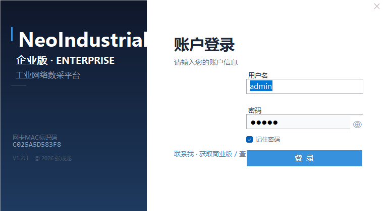

**Login** — a default administrator account is created automatically on first start

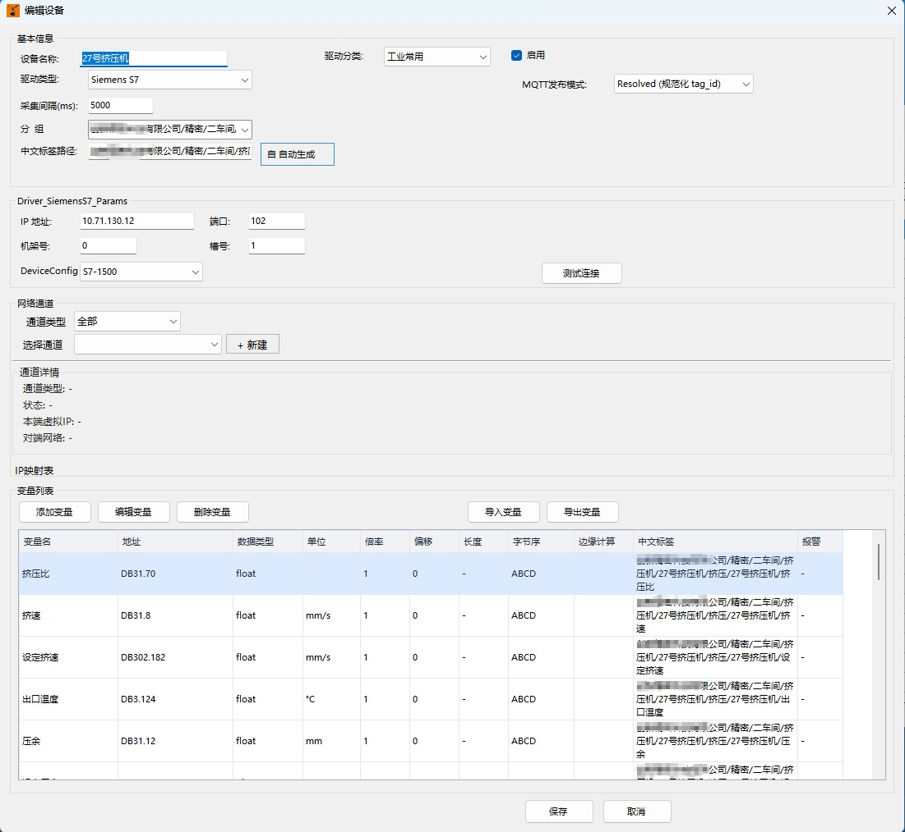

**Device management** — four-level hierarchy, groups, drag & drop, live status lights

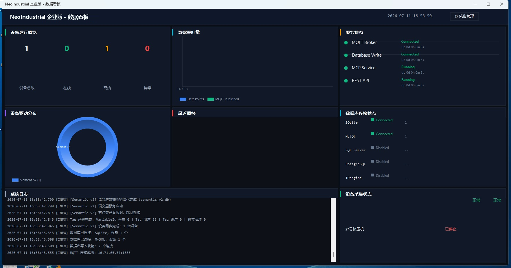

**Dashboard** — device status, live alarms, realtime values, trend curves and data-flow rates on one screen

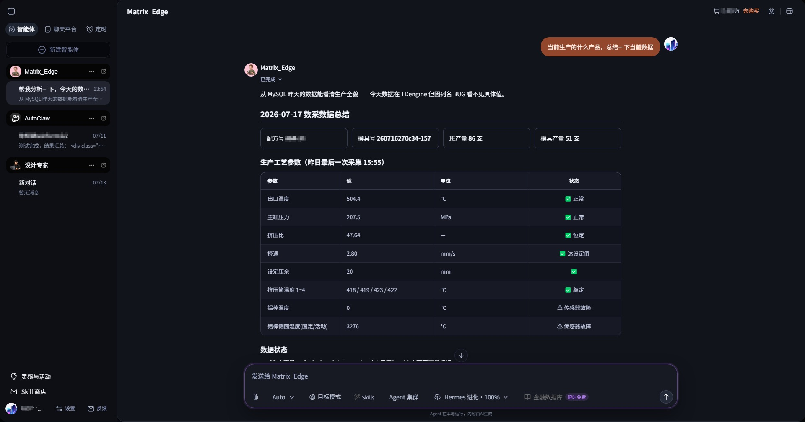

**AI assistant (MCP)** — add devices, configure variables and query data in natural language

</div>

---

## ✨ Core Capabilities

| Capability | What you get |
|------|------|
| 🔌 **39 protocol drivers in 7 categories** | PLC & controllers, CNC, industrial Ethernet, fieldbus, power & energy, building automation, IoT / semiconductor / others — all real implementations, no stubs |
| 🌲 **Four-level device hierarchy** | Company → workshop → process → device, with groups, drag & drop, "move to", live search and 🟢🔴🟡 status lights |
| 🎛️ **Per-variable configuration** | Address, data type, byte order, linear scaling (`y = kx + b`), rounding, units, HH/H/L/LL alarms, custom scripts, edge calculation and formula application — every variable individually |
| 🧹 **Edge computing** | 9 data-cleansing strategies (dead-zone, spike suppression, rate limiting, 3σ outlier removal, freeze detection …) executed in pipeline order before storage |
| 📡 **MQTT publishing** | Two-tier topics (batch packet + per-variable sub-topics), configurable publish mode per device, offline caching with automatic replay |
| 🗄️ **7 database targets in parallel** | SQLite, MySQL, SQL Server, PostgreSQL, TDengine, Oracle, ODBC — each with an independent on/off switch and automatic table creation |
| 🧬 **Semantic layer (digital-twin modeling)** | Device tree auto-syncs into a factory semantic tree; 17 variable relation types; datasource field bindings; Chinese/English tag namespace |
| ⚡ **Fabric time-series engine** | 8 hot-pluggable operators — aggregation, trend, threshold, anomaly, correlation, root-cause, prediction, daily report |
| 🎛️ **Dashboard** | Device status matrix, live alarm panel, realtime metrics, trend curves, data-flow monitoring; coexists with the collection page |
| 📋 **Event rules** | Rules attached to semantic-tree nodes with 12 handling methods — alarm, message, email, SMS, HTTP callback, work order, AI analysis … |
| 📦 **Templates · cloning · batch deployment** | Export a device's full configuration as a template, apply it to many devices, or clone an identical device and just change the IP |
| 🕳️ **Network tunnels** | VPN / NAT tunnel management with IP mapping for devices behind cross-segment networks — no need to re-address devices |
| 🤖 **AI assistant over MCP** | Built-in MCP server with 44 tools — any MCP-capable client (Claude Desktop, etc.) manages devices, variables and queries in natural language |
| 🔄 **REST API** | Standalone HTTP service with Bearer-token authentication and optional Swagger docs for third-party integration |
| 📊 **CSV bulk import/export** | Excel-compatible UTF-8 files for creating hundreds of variables in one go |
| 🌍 **Bilingual UI** | Chinese / English switchable at runtime — about 650 UI strings flip instantly, no restart |
| 🧪 **Simulator driver** | Realistic simulated process values — run the entire pipeline with zero hardware |
| 🔐 **Accounts, tokens & activation** | SHA256 + salt password storage, token authentication for MCP/REST, software activation bound to the machine |

---

## 🔌 The 39 Built-in Drivers

Drivers are organized in **7 categories** — pick the category, then the driver, in the new-device dialog.

### ⚙️ PLC & Controllers (11)

| Driver | Covers |
|------|------|
| **Modbus TCP** | Schneider, Siemens, Mitsubishi, Delta, Inovance, Xinje and every Modbus TCP device; zone-prefixed addressing (`0/1/3/4xxxx`) |
| **Modbus RTU** | RS-232/485 serial devices, same register model |
| **Siemens S7** | S7-200/300/400/1200/1500 — DB, input, output and Merker areas |
| **Beckhoff ADS** | The full TwinCAT 2/3 range |
| **CODESYS** | CODESYS V3+ compatible controllers (Beckhoff, Hollysys, Inovance, …) |
| **Mitsubishi FX** | FX1S/1N/2N/3U/5U programming port |
| **Mitsubishi MELSEC** | iQ-R / iQ-F / Q / L series via the MC protocol |
| **Keyence KV** | KV-5000/7000/8000 series |
| **Panasonic Mewtocol** | The full FP series |
| **Omron FINS** | Omron CJ/CS/CP series over FINS |
| **Omron HostLink** | Omron HostLink, serial and Ethernet |

### 🔧 CNC Machine Tools (5)

| Driver | Covers |
|------|------|
| **Fanuc FOCAS** 🔑 | 0i/16i/18i/21i/30i/31i/32i — macro variables, spindle load, alarm numbers |
| **Siemens 840D** 🔑 | Sinumerik 840D/840Di CNC systems |
| **Haas CNC** | The full NGC controller range (serial) |
| **Mazak** | Mazatrol controllers (Smooth series) |
| **Heidenhain** 🔑 | TNC series via Remo Tools / DNC |

### 🌐 Industrial Ethernet (3)

**EtherNet/IP** 🔑 — Rockwell / Allen-Bradley ControlLogix & CompactLogix · **PROFINET** — Siemens PROFINET IO · **OPC UA** — built on the official OPC Foundation stack

### 🔗 Fieldbus (3)

**PROFIBUS** — Siemens PROFIBUS DP (via gateway) · **DeviceNet** 🔑 — Allen-Bradley CIP · **CC-Link** 🔑 — Mitsubishi

### ⚡ Power & Energy (2)

**IEC 104** — power telecontrol · **DNP3** — North American power SCADA

### 🏢 Building Automation (5)

**BACnet** — Honeywell / Johnson Controls / Siemens building control · **KNX** 🔑 — smart-building bus · **DALI** — digital addressable lighting · **LonWorks** 🔑 — building control networks · **M-Bus** — heat / water / electricity meters

### ☁️ IoT / Semiconductor / Others (10)

| Driver | Covers |
|------|------|
| **MQTT Subscribe** | Reverse acquisition — devices or gateways that publish to a broker themselves |
| **Sparkplug B** | Industrial IoT MQTT sub-protocol |
| **HTTP REST** | Poll and collect from RESTful JSON APIs |
| **DLMS/COSEM** 🔑 | Smart electricity meters |
| **HART IP** 🔑 | IP variant of HART instruments |
| **MTConnect** | CNC machine connectivity standard |
| **SECS/GEM** 🔑 | Semiconductor equipment communication standard |
| **OPC DA** 🔑 | Classic OPC Data Access servers |
| **OPC UA PubSub** | OPC UA publish/subscribe mode |
| **Simulator** | Built-in simulated variables for testing, demos and training |

> ⚖️ **Drivers that require a license — please read first**
>
> **All 39 drivers in this repository are open-source implementations**, and the runtime libraries shipped with the package are under open-source licences too. **No commercially licensed driver that must be bought from a vendor is pre-installed or bundled.**
>
> If a device on site needs a commercially licensed driver, there are two routes: **① integrate it yourself** — deploy the driver you have purchased and licensed (`.dll` / `.zip`); **② let the AI add it** — the WEB Commercial Edition ships a driver-management UI that accepts uploads, and its built-in AI can search online for candidates, state the source and licence, and install only after you agree. **The licence itself must still be obtained by the user — the platform only loads the driver, it never resells or cracks anything.**
>
> The drivers marked 🔑 above are governed by **commercial licenses or membership terms from the original vendor or the standards body**. **Before production, commercial or customer-facing use, contact the vendor or licensing body, purchase a legitimate license and obtain formal permission.** Without a license, use them for learning, research and evaluation only.
>
> This software only implements protocol connectivity. It does **not** bundle, resell, crack or redistribute any vendor SDK, license file, license key or licensed feature option, and does not act as an agent for any vendor licensing.
>
> | 🔑 Licensed drivers | Who to contact | Typical license form |
> |---|---|---|
> | Fanuc FOCAS | FANUC or an authorized distributor | FOCAS library license (agreement required) |
> | Heidenhain (Remo Tools / DNC) | HEIDENHAIN | Paid machine DNC / Remo option |
> | Siemens 840D (OPC UA / Access MyMachine) | SIEMENS | Paid CNC runtime option |
> | SECS/GEM | SEMI (standards must be purchased) + the vendor SDK you use | Standards documents + vendor SDK |
> | OPC DA | The third-party OPC server vendor you connect to | Commercial OPC server license |
> | HART IP | FieldComm Group | Membership / specification license |
> | EtherNet/IP / DeviceNet | ODVA | Membership + specification subscription |
> | CC-Link | CC-Link Partner Association (CLPA) | Membership / specification license |
> | KNX | KNX Association | Membership (specifications are member-only) |
> | DLMS/COSEM | DLMS User Association | Membership (specifications are member-only) |
> | LonWorks | LonMark International / licensors | Membership / specification license |
>
> **Unmarked drivers** (Modbus, Siemens S7, Mitsubishi MC/FX, Keyence KV, Panasonic Mewtocol, Omron FINS/HostLink, Beckhoff ADS, CODESYS, Haas, Mazak, MTConnect, PROFIBUS, PROFINET, BACnet, OPC UA, IEC 104, DNP3, DALI, M-Bus, MQTT, Sparkplug B, HTTP REST, etc.) are implemented from open specifications and normally require no vendor license to implement: **MTConnect is documented by its owner as an open, royalty-free standard**, **PI states explicitly that PI membership is not required to implement PROFINET/PROFIBUS**, and **Beckhoff permits royalty-free redistribution of the unmodified ADS DLLs**. For some protocols the **standards documents themselves must be purchased or are member-only** (e.g. ASHRAE 135 / BACnet, IEC 62386 / DALI, EN 13757 / M-Bus, IEC 60870-5-104, IEEE 1815 / DNP3) — but buying the specification is enough to implement; no vendor license fee is involved. **Whether a license is required is ultimately governed by the vendor's and standards body's current terms — this table is a heads-up only.**
>
> **Compliance & responsibility**: users must verify and obtain all licenses and permissions required for the devices and protocols they use. This software is provided "as is" with no warranty regarding third-party protocol licensing; any liability or dispute arising from the use of such protocols without a license rests with the user.

---

## 🚀 Quick Start

### Requirements

| Item | Minimum | Recommended |
|------|----------|----------|
| OS | Windows 7 SP1 / Windows Server 2008 R2 | Windows 10 / Windows Server 2019+ |
| Runtime | .NET Framework 4.8 | .NET Framework 4.8 ([download](https://dotnet.microsoft.com/download/dotnet-framework/net48)) |
| Memory | 4 GB | 8 GB+ |
| Disk | 500 MB (excluding stored data) | SSD |

### Build from source

**Toolchain:** Windows + **Visual Studio 2019 or newer** with the **.NET Framework 4.8 developer pack** installed, or a standalone MSBuild from the same toolset. NuGet packages are **not** committed — `packages/`, `bin/` and `obj/` are all ignored — so restore them first.

**Option 1 — one-click preparation (recommended):**

```bat
git clone https://github.com/18354356258/NeoIndustrial.git
cd NeoIndustrial
setup.bat
```

`setup.bat` at the repository root does three things: clears stale build output (`bin/`, `obj/`), unblocks files that Windows flagged as downloaded (a zip download breaks builds otherwise), and runs `nuget restore` on the solution — downloading `nuget.exe` automatically if it is missing.

**Option 2 — manual:**

```bat
nuget restore IndustrialDataCollector.sln
msbuild IndustrialDataCollector.sln /p:Configuration=Release
```

Or open `IndustrialDataCollector.sln` in Visual Studio and build from the IDE (right-click the solution → Restore NuGet Packages, then Build).

**Output:** `IndustrialDataCollector/bin/Release/IndustrialDataCollection.exe` — no installation needed, keep the exe together with its resource folders and run.

### First launch

1. Double-click `IndustrialDataCollection.exe` (a global mutex prevents a second instance; if Windows SmartScreen asks, click "Run anyway");
2. Log in with the default account **admin / admin** — created automatically on first start with administrator rights. **Change this password before production use.**
3. Complete **software activation**: enter your license key — activation is **online** (automatic when connected) or **offline** (export a request file, obtain a license file, import it back). The license is bound to the machine's MAC address (virtual adapters are filtered automatically) and stored as `license.dat` in the config directory.
4. The program opens the **Dashboard**; click **Collection Management** to enter the collection window. First start creates the local database, account store, semantic database and config directory automatically — nothing to pre-configure.

### Your first collection task (no hardware needed)

1. In the device tree, right-click → **Add Device** → pick the **Simulator** driver;
2. Double-click the device → **Add Variable** (or use **CSV Import** for a batch) → **Apply** — changes take effect on the next cycle without stopping;
3. Right-click the device → **Start Collection** — the status light turns green;
4. Open the Dashboard: realtime values, trend curves and the data-flow meters are already rolling.

### Connecting real devices

| Device type | Key configuration |
|----------|---------|
| Modbus TCP PLC | IP + port 502 + station number + register address (zone prefixes `0/1/3/4xxxx` supported) |
| Siemens S7-1200 | IP + Rack 0 / Slot 1 + DB address (e.g. `DB1.DBD0`) |
| Fanuc CNC | IP + port 8193 + macro variable number (FOCAS) |
| MQTT-publishing device | Driver **MQTT Subscribe** + broker address + `TopicFilter` (`#` for everything, `/VariableName` for a single variable) |

**Recommended configuration order:** database first (where data goes) → MQTT (if publishing) → groups & devices → variables → start & verify → semantic tree and event rules last. The semantic tree never blocks collection — it can be added at any time.

---

## 📖 Usage Highlights

### Device management

The device tree organizes everything as **company → workshop → process → device**. Right-click any node to add, rename or delete; drag & drop to move devices or whole folders; use **Move to…** for precise relocation via a path picker; the search box filters live by name or IP. Each device runs in its own collection thread and shows a status light — 🟢 collecting, 🔴 stopped, 🟡 fault. Device group paths drive the automatic Chinese tag namespace (`Workshop1/Extruder/Extruder-28/BarrelTemp`).

### Variable configuration

Double-click a device to open its configuration. Every variable carries:

| Field | Description |
|------|------|
| Variable name | Chinese/English label |
| Address / register | Protocol address (Modbus `40001`, S7 `DB1.DBD0`, …) |
| Data type | Int16 / Int32 / Float / Double / Bool / String |
| Byte order | ABCD (big-endian) / DCBA (little-endian) / BADC / CDAB |
| Collection interval | Milliseconds, per variable |
| Linear scaling | `y = kx + b` — raw value to engineering value |
| Rounding & unit | Decimal places, engineering unit (℃, MPa, rpm …) |
| Alarms | HH / H / L / LL four-level thresholds |

**Apply takes effect immediately** — the configuration is written to disk and running devices pick it up on the next collection cycle, no stop required.

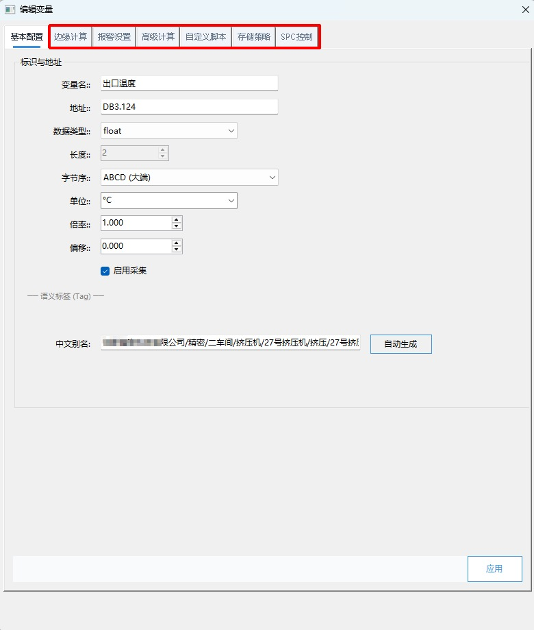

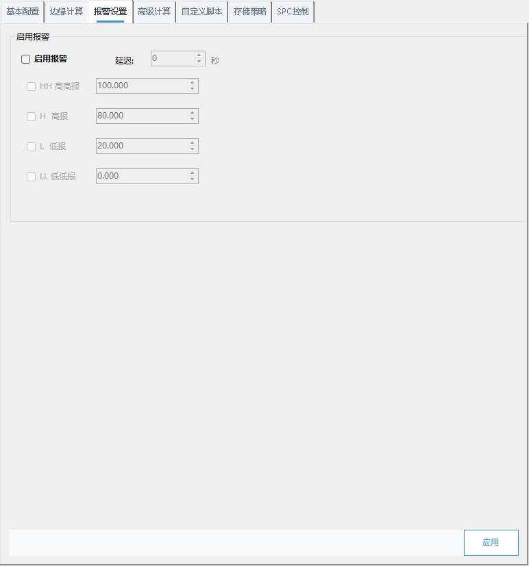

### Data quality at the edge

Enable edge computing per variable (`PointEditForm_Edge`). Nine cleansing strategies run in pipeline order, plus rounding, first/second-order filtering, calculation formulas (e.g. `{Temp} * 1.8 + 32`) and the four alarm levels:

| Category | Strategy | Effect |
|------|------|------|
| Value correction | Null filter | Detects NaN / Inf / negatives; replaces with last valid or fixed value |
| | Dead-zone suppression | Small fluctuations are not recorded until the change exceeds a threshold |
| | Spike suppression | MAD-based single-point jump detection; replaced by the median |
| | Rate limiting | Clamps the maximum change between consecutive samples |
| | Clamping | Truncates to max/min limits |
| | Outlier removal | 3σ statistical removal of outliers |
| Quality checks (log only) | Freeze detection | Flags N consecutive identical values (possibly a stuck sensor) |
| | IQR | Inter-quartile-range outlier flagging |
| | Range sanity | Flags values beyond the sensor's physical range |

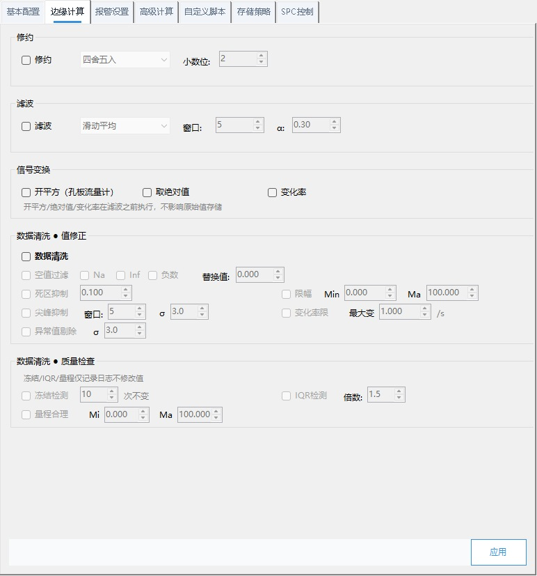

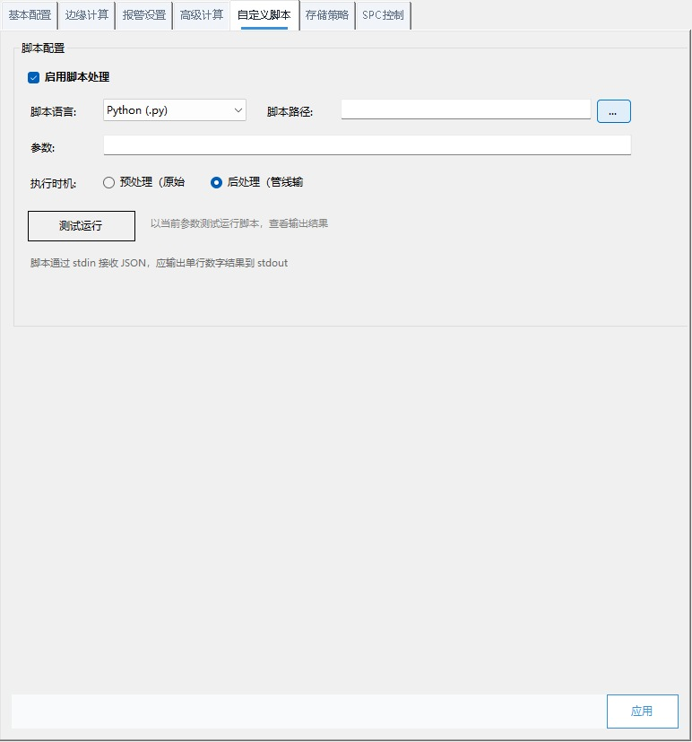

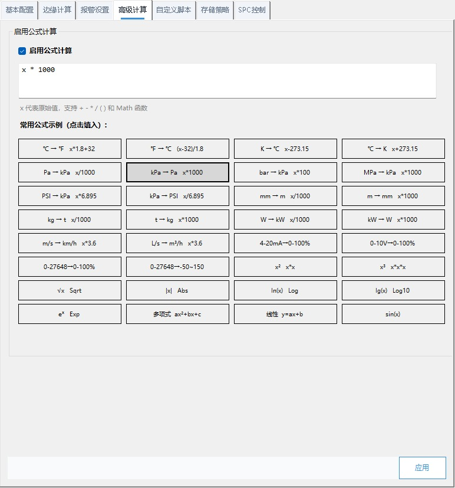

### MQTT publishing

One global broker configuration (address, port 1883/8883, client ID, credentials, topic prefix, QoS, auto-reconnect) referenced by every device. Each device selects a publish mode:

| Mode | Topics | Behavior |
|------|------|------|
| **Original (batch only)** | `{prefix}/{DeviceName}` | One complete JSON packet per collection cycle |
| **Resolved (batch + sub-topics)** | `{prefix}/{DeviceName}` + `{prefix}/{DeviceName}/{VariableName}` | Batch packet plus a per-variable sub-topic push |

Batch message example:

```json
{
  "timestamp": 1783176200000,
  "driver": "SiemensS7",
  "device": "Extruder-28",
  "values": [
    {
      "id": "Extruder-28|BarrelTemp",
      "dt": "float",
      "v": "72.3",
      "u": "°C",
      "variable_id": "a1b2c3d4-...",
      "tag_cn": "Workshop1/Extruder/Extruder-28/BarrelTemp"
    }
  ]
}
```

While the link is down, unpublished messages accumulate in an independent offline cache and are replayed automatically on recovery — no data loss regardless of outage length.

### Database storage

Seven database types, each with an **independent enable switch** — write to one, or to all of them in parallel:

| Database | Notes | Auto table creation |
|--------|------|:---:|
| **SQLite** | File-based, zero config — the default | ✅ |
| **MySQL** | Server / port / user / password / database | ✅ |
| **SQL Server** | Instance name, auth mode, database | ✅ |
| **PostgreSQL** | Host / port / user / password / database | ✅ |
| **TDengine** | REST interface (port 6041), one super table per device | ✅ |
| **Oracle** | Via the dedicated adapter | ✅ |
| **ODBC** | Any ODBC-accessible source | ✅ |

All targets share the same row schema — one row per collected value: `device`, `variable`, `data_type`, `value`, `unit`, `tag` (English tag), `tag_zh` (Chinese tag path), `timestamp`. A **retention-days** setting (default 7, `0` = keep forever) drives a batched cleanup job every 6 hours; for TDengine, manage retention with the database's own `KEEP` parameter and set the platform retention to 0.

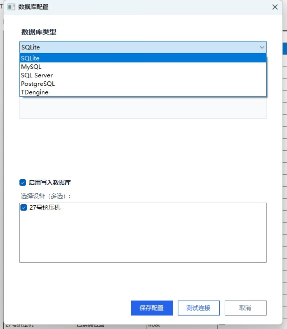

### MCP AI integration

The built-in **MCP server** exposes **44 AI-callable tools**. Any MCP-capable client — Claude Desktop and friends — connects over Streamable HTTP and then operates the collector in plain language:

```
User: Add a Siemens S7-1200 PLC at IP 192.168.1.100
AI  : Device created (protocol S7). Now let's configure variables — provide the register addresses.

User: Temperature DB1.DBD0 (float), pressure DB1.DBD4 (float), status M0.0 (bool)
AI  : Added 3 variables (°C / MPa / bool). Configure alarms?

User: Alarm above 85 for temperature, below 0.3 for pressure
AI  : Alarm rules configured. Start collection now?

User: Start, and give me a report in 30 minutes
AI  : Collection started. (30 minutes later) Report generated: avg outlet temp 72.3 °C … 0 alarms.
```

To enable it: **Tools → MCP Service Config** → set the port (default **5101**, auto-increments if busy — the effective port is logged) → generate a token → enable. Endpoint: `http://<machine-ip>:5101/mcp?token=***`.

Tool coverage: device CRUD & collection control · variable management · datasource analytics (discover sources → inspect schema → sample → time-range queries, no SQL needed) · realtime & history queries · semantic tree queries and writes · Fabric analytics · platform self-description · plus one dynamic tool registered per configured datasource.

**Safety by design:** destructive operations (deleting devices or relations) are deliberately excluded from MCP — they happen only in the UI, behind a double-confirmation gate.

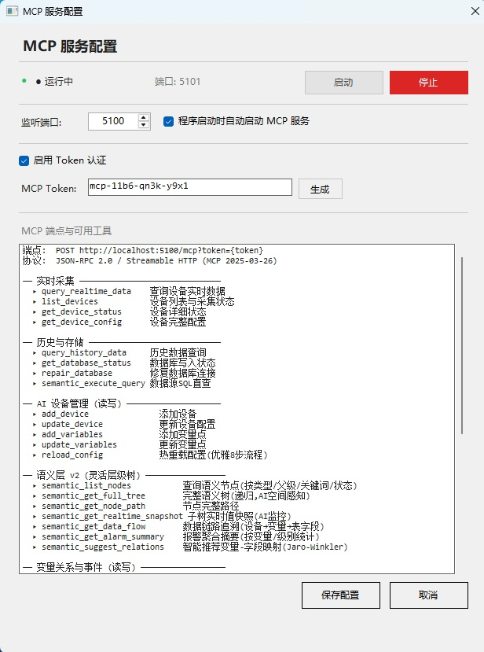

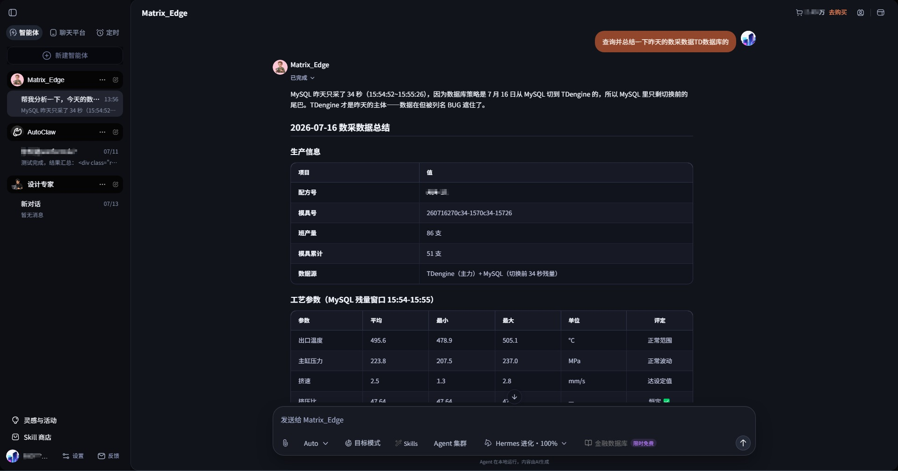

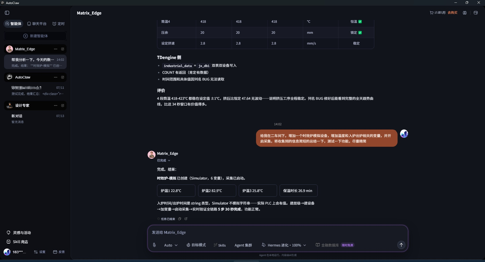

### REST API

**Tools → API Service Config**: standalone HTTP service, default port **5000**, Bearer-token authentication, optional Swagger documentation.

```
Authorization: Bearer <your-token>

GET /api/devices                              # device list
GET /api/devices/{id}/realtime                # realtime data
GET /api/variables/{id}/history?from=&to=     # history
GET /api/status                               # system status
```

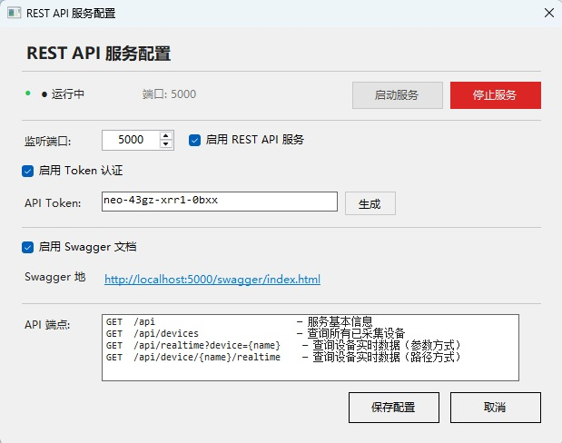

### CSV bulk import

For large point lists: **Export Template** on the device configuration page → fill the UTF-8 CSV in Excel → **Import CSV** to create every variable in one shot, alarms and scaling included.

### Network tunnels

Devices behind VPN/NAT don't need re-addressing. Create a tunnel (VPN: OpenVPN / L2TP / IPsec, TUN or TAP; NAT: generic or vendor-specific), maintain the IP mapping table (`original IP:port → mapped IP:port`), then select the tunnel on the device — collection flows through the mapped address.

### Logs & troubleshooting

| Location | Content |
|------|------|
| `Logs/` (next to the exe) | Daily runtime logs; older than 30 days are purged automatically |
| `%LOCALAPPDATA%\IndustrialDataCollection\` | `devices.json` (all device/variable config), `groups.json`, `mqtt.json`, `dbConfig.json`, `datasources.json`, `auth.db` (accounts), `semantic_v2.db`, `tunnels.json`, `license.dat`, `crash.log` |
| `Data/offline_cache.db` | MQTT / database offline caches + device heartbeats |

Default log level is Info (start/stop, errors, API requests). When the app crashes, check `crash.log` first. Exiting from the tray runs a reverse-order shutdown so MQTT, databases and collection threads are released cleanly.

---

## 🏭 Enterprise-Grade Capabilities

### Semantic layer · digital-twin modeling

The device tree auto-syncs into a factory semantic tree (workshop / line / equipment / variable) — no manual rebuild. Drag-to-reorganize changes are remembered (`parent_override`) and survive later syncs. On top of the hierarchy:

- **Tag system** — one unified variable namespace across devices and protocols (`Workshop1/Extruder/Extruder-28/BarrelTemp`);
- **Variable relations** — 17 relation types plus bindings of variables to datasource fields, constants or expressions; trace any datum from source device → driver → database → topic;
- **Node events** — event rules attach to semantic nodes: pick a trigger (threshold / state change / device offline) and one or more of **12 handling methods** (log, alarm, message, email, SMS, HTTP callback, workflow / work order, MCP task / AI analysis …);
- **Node status** — synced nodes follow their devices; manual nodes are freely editable.

Alarm output is machine-parsable and source-pinned: `[ALARM HH] [Extruder-28] BarrelTemp = 92.5 °C`.

### ⚡ Fabric time-series engine

Eight hot-pluggable operators for analysis that would otherwise need hand-written SQL or scripts:

| Operator | Function | Typical use |
|------|------|------|
| **window_aggregate** | Windowed aggregation (avg / max / min / sum / count / stddev) | Hourly averages, daily peaks |
| **trend_detect** | Trend detection over historical series | Rising temperature trends |
| **threshold_alarm** | Threshold checks | Process-window violations |
| **anomaly_detect** | Statistical outlier detection | Sudden spikes, sensor drift |
| **correlation** | Multi-variable correlation | Vibration vs. temperature |
| **root_cause** | Trace contributing upstream variables | Fault diagnosis |
| **predict** | Short-term linear-regression forecasting | Predictive maintenance |
| **daily_report** | Automated report generation | Shift-handover summaries |

Fabric reads history from any enabled database (tick **Fabric history** in the database configuration) and executes through MCP (`fabric_list_operators` / `fabric_execute`), so the AI can run analytics as part of a conversation.

### 🎛️ Dashboard

The default main window, coexisting with the collection page (monitor and adjust configuration at the same time): per-device collection / MQTT / REST status, a live alarm panel with a 20-minute window and duplicate merging, realtime metrics, trend curves and data-flow monitoring (collection rate, write rate, throughput). Four alarm levels — HH / H / L / LL — keep severity obvious at a glance.

### 📦 Templates · cloning · batch deployment

- **Config templates** — export a device's complete configuration (driver + variables + alarms + MQTT mode + semantic relations, Fabric, events and cleansing) as a reusable template; manage, search and delete templates in Template Management;
- **Apply template** — match by variable name onto a different device model, with per-device overrides afterwards;
- **Device cloning** — full config inheritance for identical devices: clone, change the IP and register addresses, apply, start.

Deploying ten identical devices becomes a two-minute job instead of an afternoon.

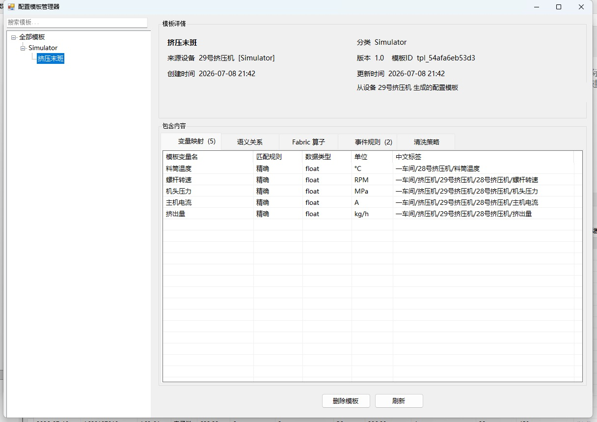

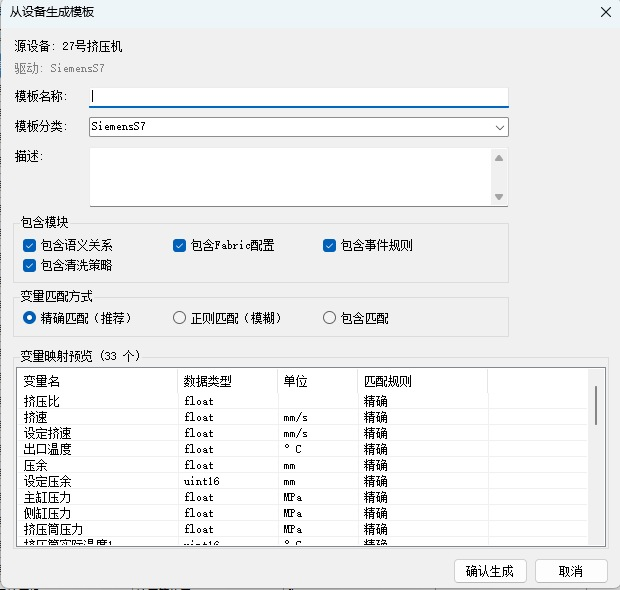

### 🗄️ TDengine

High-frequency time-series workloads land in TDengine through its REST interface: one super table per device, reserved words mapped automatically (`value → val`, `tag → tag_id`, `timestamp → ts`), suited to tens of millions of points per day.

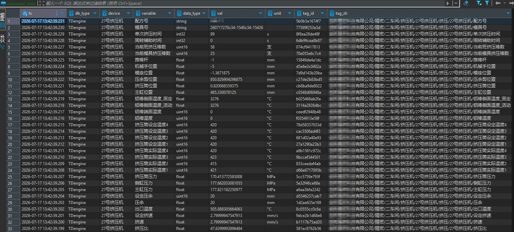

### 🛡️ Reliability & configuration safety net

| Mechanism | Behavior |
|------|------|
| **Dual offline caches** | MQTT and database writes fail independently; each keeps its own cache (`offline_mqtt_cache` / `offline_db_cache`), checked every 10 seconds and replayed on recovery — cached data is never deleted by age |
| **Device heartbeats** | Per-device heartbeat records in the offline cache database |
| **Auto-reconnect** | MQTT reconnects automatically after disconnects |
| **Auto-recovery** | A corrupted `devices.json` is restored from backups automatically; the corrupt file is kept as `.corrupted` and the incident is logged |
| **Rolling config backups** | Every save rotates `devices.json.bak.1 ~ .bak.50`; roll back from **Tools → Config History**, or press **Ctrl+Z** outside text fields |
| **Single instance** | A global mutex blocks double launch |
| **Clean shutdown** | Reverse-order shutdown of every subsystem, 5-second timeout per step |

---

## 🆚 Enterprise Edition vs WEB Commercial Edition

One protocol driver core, two delivery forms: the **Enterprise Edition** is a desktop client installed on an industrial PC (this repository, open source); the **WEB Commercial Edition** is a browser platform that lives on a server (closed source, commercially licensed).

| Capability | Enterprise Edition (this repo) | WEB Commercial Edition |
|----------|:---:|:---:|
| Industrial protocol drivers (PLC / CNC / power / building / semiconductor) | 39 | 39 (same core, **all open-source implementations**) |
| Millisecond MQTT push | ✅ | ✅ |
| SQLite / MySQL / SQL Server / PostgreSQL | ✅ | ✅ |
| TDengine time-series database | ✅ | ✅ |
| Dameng DM8 (domestic database) | ❌ | ✅ |
| MCP AI tools | 44 | **150** |
| **Driver management (categories / upload / AI-added)** | ❌ | ✅ |
| REST API | ✅ | ✅ |
| CSV bulk import/export | ✅ | ✅ |
| UI languages | Chinese / English | Chinese / English / Vietnamese (+ built-in manual) |
| **Semantic-layer digital-twin modeling** | ✅ | ✅ |
| **2D / 3D knowledge-graph visualization** | ❌ | ✅ |
| **Fabric time-series engine** | ✅ (8 operators) | ✅ (27 operators) |
| **Dashboard monitoring wall** | ✅ | ✅ |
| **Config templates · device cloning** | ✅ | ✅ |
| **Offline caching · re-send** | ✅ | ✅ |
| **Event rule engine** | ✅ | ✅ |
| **Auth · hardware binding · Token** | ✅ | ✅ |
| **Multi-user online collaboration · audit trail** | ❌ | ✅ |
| **AI multi-agent · memory & self-evolving skills** | ❌ | ✅ |
| **Browser (B/S) access — no per-PC install** | ❌ | ✅ |
| **Xinchuang Linux support (self-contained package)** | ❌ | ✅ |
| **Multi-generation rolling config backups** | ✅ | ✅ |
| **Commercial license · technical support** | ✅ | ✅ |

> 🖥️ **Enterprise Edition**: single-machine desktop, works offline, 39 drivers out of the box — ideal for deep acquisition on one plant/machine and for edge-side deployment.
> 🌐 **WEB Commercial Edition**: the whole factory in a browser — multi-user collaboration, AI multi-agent orchestration, 2D/3D knowledge graph and Xinchuang support. See the next section.

---

## 🌐 WEB Commercial Edition — The Whole Factory in a Browser

> The Enterprise Edition is software installed on an industrial PC; the WEB Commercial Edition is an industrial data operating system that lives on a server.
>
> The same protocol driver core, plus B/S multi-user collaboration, AI multi-agent orchestration and 2D/3D industrial semantics. It is not a port of the desktop edition — it is a redesigned, web-native platform.

What it solves that the desktop edition cannot:

- **One industrial PC → one network**: open a browser and go. No per-machine installs; upgrade once and the whole plant is on the new version.
- **One operator → a whole team online**: three-tier permissions (organization / role / user) with concurrent access; who changed a config, who exported which data — everything is logged and auditable.
- **AI as an add-on → AI-native**: a built-in AI chat workspace with multi-agent orchestration. AI operates the platform directly — add devices, configure variables, query historical data, build dashboards — and agents can dispatch tasks to one another.
- **Forgets you → learns you**: AI memory, team knowledge distillation, and skills that are captured automatically and self-improve. The longer you use it, the better it understands your plant and your process.
- **Flat tables → 2D/3D knowledge graph**: an industrial semantic tree plus relationship-graph visualization turns "40001 = 245.6" into a digital twin you can see, click into, and trace.

### 📸 Semantic knowledge graph in 2D / 3D

<div align="center">

&nbsp;

&nbsp;

&nbsp;


**▲ Semantic-graph highlights — layout switching · 2D / 3D** (looping GIFs)

</div>

### 🎬 WEB Commercial Edition — full demo video

<div align="center">

<a href="https://github.com/18354356258/NeoIndustrial/raw/main/picture/web-demo.mp4"></a>

**▶ Click the cover to watch the full demo** (1 min 53 s · 1080p)

</div>

This video is a complete walkthrough of the **WEB Commercial Edition** — from **data collection** to the **semantic knowledge graph (2D / 3D)** and the **Hermes Evolution Agent**:

- **① Data collection**: device-tree management (workshop → process → device) with per-variable configuration and custom Python post-processing scripts (e.g. sliding-window filtering) that turn raw signals into clean, production-ready data;
- **② Semantic graph 2D / 3D**: switch between force-directed, radial, tree, star, star-orbit, flow, chip and ring layouts in one click; in 3D sphere mode you can rotate and zoom to grasp the whole relationship network at a glance;
- **③ Hermes Evolution Agent**: **self-evolution** (automatic skill distillation, evolution-proposal approval, feedback-driven skill refinement) · **scheduled tasks** (report / query-summary / alert / digest jobs with custom cron, generating daily briefs and HTML boards from natural-language instructions) · **push settings** (in-site messages + email + WeCom / DingTalk / Feishu bot webhooks).

> 📺 Recorded on the WEB Commercial Edition; best viewed at 1080p.

### Core capabilities

| Capability | Details |
|------|------|
| 🔌 Industrial protocol drivers | **39** production-ready drivers built in, **all of them open-source implementations** (PLC / CNC / power / building / semiconductor / meters), sharing the same core as the Enterprise Edition; organized into 7 driver categories — pick the category first, then the driver |
| 🧩 Driver management | A single driver inventory: driver / category / source / provider / size / installed at / status, filterable by keyword, source and category. **Commercial-licensed drivers you have purchased, or open-source drivers, can be uploaded by you**; built-in drivers can be disabled and restored, plugin drivers can be deleted |
| 🤖 AI adds drivers | For a protocol the platform does not have, just ask the built-in AI to search online: it explains the source and the license, and installs into the category you choose once you agree. The source URL and time are recorded server-side, and the inventory marks it "Added by AI" |
| 🗄️ Parallel database writes | 6 kinds: SQLite / MySQL / SQL Server / PostgreSQL / TDengine / Dameng DM8 (domestic, Xinchuang-ready) |
| 🤖 MCP atomic tools | **150** AI-callable tools, covering device collection & control, collection drivers, data sources, offline cache, Fabric time-series analysis and industrial semantics |
| 🧠 AI multi-agent | Built-in chat workspace; create your own agents, grant each one a capability boundary, and let them collaborate by dispatching tasks |
| 🔬 Fabric time-series engine | 27 hot-pluggable operators: aggregate / correlation / anomaly / digital-twin benchmarking / rate / accumulate / threshold / prediction… |
| 🕸️ Industrial semantics & knowledge graph | Semantic tree + variable relation types + event type catalog, with 2D/3D graph visualization |
| 📊 Dashboards · alarms · scheduled jobs | Real-time monitoring wall, 4-level alarms, scheduled reports, in-app messages and a document workspace |
| 👥 Permissions & audit | Three-tier permissions (organization / role / user), user activity tracing, system logs, hardware management |
| 🌍 Trilingual | Chinese / English / Vietnamese, switchable at runtime, with the built-in product manual in all three |
| 🧩 Xinchuang-ready | A self-contained Linux x64 runtime package (no .NET install required), with Dameng DM8 usable out of the box |
| 🚀 Deployment | Runs on a single machine; .NET 8 + Blazor, browser access, no client install on every PC |

### 🔌 Driver categories & driver management

Connecting a device is a two-level choice — **category first, then driver** — and the collection page and the driver management page share one category definition:

| Category | Covers | Built-in drivers |
|------|------|:---:|
| Industrial common | General industrial protocols, simulator | 8 |
| PLC / industrial control | Mainstream PLCs and controllers | 8 |
| CNC | Machine tools and CNC systems | 6 |
| Building automation | HVAC, lighting, meters | 4 |
| Power / energy | Power protocols and metering | 5 |
| Semiconductor | Semiconductor and fieldbuses | 3 |
| General / other | HTTP, OPC, etc. | 5 |

What the driver management page does:

- **One inventory** — driver / category / source / provider / size / installed at / status / actions, filterable by keyword, source and category;
- **Upload assigns the category** — uploading a `.dll` or `.zip` (≤100 MB) requires choosing the category first, so the driver lands exactly where it belongs;
- **Re-categorise in place** — a plugin driver's category can be switched right in the list;
- **Built-in drivers can be disabled / restored, plugin drivers deleted** — built-in drivers ship with the program (their code cannot be deleted) and can be disabled and restored; uploaded plugins can be removed together with their folder;
- **Added by AI** — for a protocol the platform lacks, ask the AI to search online, explain the source and licence, and install into the chosen category once you agree (marked "Added by AI"; source URL and timestamp are recorded server-side, not self-reported by the AI).

### Which edition should you choose?

| Your scenario | Recommended edition |
|----------|----------|
| Single plant, single machine, deep desktop use, semantic layer + dashboards | **Enterprise Edition** — open source in this repository; the client is downloadable from Releases, and a formal license is issued by machine ID |
| Multi-user online collaboration, plant-wide governance, AI multi-agent, Xinchuang environments | **WEB Commercial Edition** — apply to the author (licensed by device/machine count) |

### How to get it (important)

- **Enterprise Edition (this repository)**: the client is **freely downloadable from this repository's Releases page** for evaluation; the source is Apache 2.0, so you can clone and build it yourself. For a formal license, send your machine ID by email.
- **WEB Commercial Edition**: **no public download**. A license must be applied for directly from the author, priced by device/machine count.
- **In-app shortcut**: in the desktop client, **Help → Contact Me** opens both repositories and lets you copy the licensing e-mail; the login screen also carries a “Contact Me · Get Commercial Edition” link.

**To apply for a WEB Commercial Edition license, please state the following five items in your email or call:**

1. **Use case** — which industry, which production line, and what problem you want to solve;
2. **Applicant** — a company or an individual;
3. **Intended purpose** — in-house production / project delivery / teaching & research / secondary development…;
4. **License period** — the expected term and go-live date;
5. **Number of devices** — how many devices or machines you need to manage.

📮 Email: `751326339@qq.com`　📞 Phone: `18354356258` / `18854344113` (Zhang Chenglong, WeChat available)

---

## 📁 Repository Layout

```
NeoIndustrial/
├── IndustrialDataCollector.sln      # the solution
├── setup.bat                        # one-click environment prep (clean + unblock + nuget restore)
├── LICENSE                          # Apache License 2.0
├── docs/                            # user manuals (EN/CN) and release notes
├── picture/                         # screenshots used by this README
└── IndustrialDataCollector/         # the application source
    ├── Controls/                    # shared UI controls
    ├── Drivers/                     # 39 protocol drivers + IDriver interface + DriverManager
    ├── Forms/                       # WinForms UI (34 forms: device, MQTT, database, semantic, MCP, dashboard …)
    ├── Models/                      # data models
    ├── Properties/                  # assembly info
    ├── Resources/                   # language packs and resources
    ├── Services/                    # collection engine, database adapters, MQTT publishing, MCP,
    │                                # REST API, semantic service, Fabric engine, templates, licensing …
    └── Utils/                       # helpers
```

**Third-party dependencies** are managed with NuGet via `packages.config` (31 packages), including MQTTnet, NModbus (+ NModbus.Serial), S7netplus, the official OPC Foundation UA stack, MySqlConnector (MIT), Npgsql, System.Data.SQLite, Newtonsoft.Json and log4net. Each keeps its own license.

---

## 📜 Version History

### v1.2.3 (current)

The open-source snapshot of the desktop client: complete source for all 39 drivers, the full service layer (collection, storage, MQTT, MCP, REST, semantic, Fabric, templates, licensing) and the entire UI.

### v1.0.2 | 2026-09-21 — Modbus address-zone fix

- **Zone-prefixed addressing**: variable addresses now accept `0/1/3/4xxxx` zone prefixes (1-based) — `0xxxx` coils, `1xxxx` discrete inputs, `3xxxx` input registers, `4xxxx` holding registers; plain numbers keep the legacy 0-based holding-register behavior;
- **Read-failure visibility**: read errors now show `ERR` in the live view and are logged (previously silently reported as 0) — applies to both Modbus TCP and RTU;
- **Verified**: 20/20 automated tests against a local Modbus TCP slave simulator (9 parsing + 11 read cases).

### v1.0.0 | 2026-07-16 — first release

- 39 industrial protocol drivers across PLC, CNC, power, building automation and IoT;
- MQTT two-tier topic publishing;
- MCP AI tools + REST API;
- CSV bulk import/export; bilingual Chinese/English UI; simulator driver;
- SQLite / MySQL / SQL Server / PostgreSQL parallel writes.

Later releases added the TDengine / Oracle / ODBC targets, the semantic layer, the Fabric engine, templates & cloning, tunnels and more. The full (Chinese) release notes live at `docs/工业数采平台_版本记录.md`.

---

## ❓ FAQ

**Q1: The device shows offline but it is actually online?**
Check connectivity first (ping / telnet to the device port), open the port in the firewall (Modbus 502, S7 102, …), verify station number / baud rate against the device, and for cross-segment devices confirm a tunnel is selected. Then check `Logs/` for the actual error.

**Q2: Data is not written to the database?**
Click **Test Connection** in the database config; make sure that database's **enable switch** is ticked; the database user needs CREATE TABLE / INSERT rights; check the device is included in that database's device list (empty = all devices). While the link is down, rows accumulate in the offline cache and replay on recovery.

**Q3: Data older than 7 days disappears — I want permanent retention?**
Retention days defaults to 7 with cleanup every 6 hours. **Set it to 0 for permanent retention.** For TDengine, manage retention with the database-side `KEEP` parameter instead and set the platform retention to 0.

**Q4: Will an MQTT outage lose data?**
No. MQTT and database writes maintain independent offline caches replayed every 10 seconds — no data loss no matter how long the outage.

**Q5: The AI assistant cannot connect?**
Make sure the MCP service is enabled, use the effective port from the log (default 5101, auto-increments when busy), match the token, and use the Streamable HTTP transport. If the port shows "access denied", run as administrator or authorize once: `netsh http add urlacl url=http://+:5101/ user=Everyone` (REST uses 5000).

**Q6: I broke the configuration — how do I roll back?**
Tools → Config History → pick a version → roll back; or press **Ctrl+Z** outside text fields. Auto-recovery from backups is the last safety net.

**Q7: Deploying 10 identical devices one by one is slow?**
Configure one → right-click **Clone Device** → change the new device's IP and register addresses → apply → start. Use **config templates** for different device models.

**Q8: Which column identifies a variable in `industrial_data`?**
`tag_zh` — the Chinese tag path (e.g. `Workshop1/Extruder/Extruder-28/BarrelTemp`); `device` and `variable` carry the plain names; on TDengine the mapped names are `tag_id / val / ts`.

**Q9: Can the dashboard and the collection page be open at the same time?**
Yes — they coexist. Closing the dashboard returns to the collection page without exiting the process.

**Q10: Forgot the admin password?**
The account store is `auth.db` in the config directory. Contact technical support for a reset — do not delete `auth.db`, other settings depend on it.

**Q11: Anything to watch out for when migrating machines?**
Back up the whole config directory (especially `devices.json`, `groups.json`, `mqtt.json`, `dbConfig.json`, `semantic_v2.db`, `license.dat`). The license is bound to the MAC address — arrange re-activation before changing hardware.

---

## 🤝 Contributing

One person can go fast, but a group of people can go far.

This project was written by one person — it is definitely not perfect, it definitely has bugs, and there are definitely industrial protocols out there you've seen and the author has never heard of. **And that's fine.** The point of open source was never "hand over a flawless finished product" — it's "put something useful here so the people who need it can use it, improve it, and make it better together".

- 🐛 **Report bugs** → [GitHub Issues](https://github.com/18354356258/NeoIndustrial/issues) — attach today's log from `Logs/`, `crash.log` if any, the driver type and a sanitized screenshot of the connection parameters;
- 💻 **Contribute code** → Fork → branch → PR (make sure it builds);
- 🔌 **Request a driver** → open an issue with the tag `driver-request` — describe the device, the protocol and where its documentation lives;
- 📖 **Improve docs** → the manuals in `docs/` and this README all accept PRs;
- 💬 **Just want to chat** → open an issue anytime, no bug required.

If this project helped you connect a PLC and solve a real problem, **give it a Star ⭐** — it costs nothing and it keeps the project alive.

---

## 📄 License

The source code in this repository is released under the [Apache License 2.0](LICENSE) — free for commercial and non-commercial use, redistributable under the license terms.

**Software activation:** the application includes an activation module — a license key bound to the machine's MAC address, activated online or offline, verified at every start. To obtain a license key for a deployed instance, contact the author:

> 📮 Email: `751326339@qq.com`　📞 Phone: `18354356258` / `18854344113` (Zhang Chenglong, WeChat available)

**Third-party components** (NuGet packages and protocol runtime libraries) remain under their own licenses; see the notice in the driver section regarding vendor-licensed protocols.

---

## 👤 About the Author

**Zhang Chenglong** — art student turned full-stack developer, digital-twin system architect.

In the spring of 2026, while building the UI prototypes and driver logic for an aluminum-extrusion digital-twin system, one thing was missing: something that could actually connect to every device on the shop floor. PLCs, CNCs, sensors, meters, power cabinets, building controllers — they all speak different languages. The options out there were either absurdly expensive, too heavy for an industrial PC, or so old they had never heard of AI.

**So the brush went down and Visual Studio opened.** (Background: joined a steel plant right after graduation; 3 years in the aluminum-extrusion industry; 12 years in IT in total.) In under three months, one person built from scratch: 39 industrial protocol drivers, multi-database parallel writes, millisecond MQTT publishing, 50 MCP AI tools, a REST API and a live dashboard — the set of nerve endings that brings a digital twin to life.

Why open source? Because getting a usable data-acquisition program onto your own industrial PC, for free, shouldn't require sky-high license fees, pirated installers, or two months wrestling with a patchwork of components that still can't talk to your devices. Industrial data acquisition is the bedrock of digital twins and smart manufacturing — and now it's here, source and all: download, build, connect your devices.

**This is not "yet another piece of industrial software". This is the data foundation of the digital-twin world — opened up.**

---

<div align="center">

**Industrial Data Collector — the data foundation of the digital twin**

© 2026 Zhang Chenglong · Apache License 2.0

</div>
