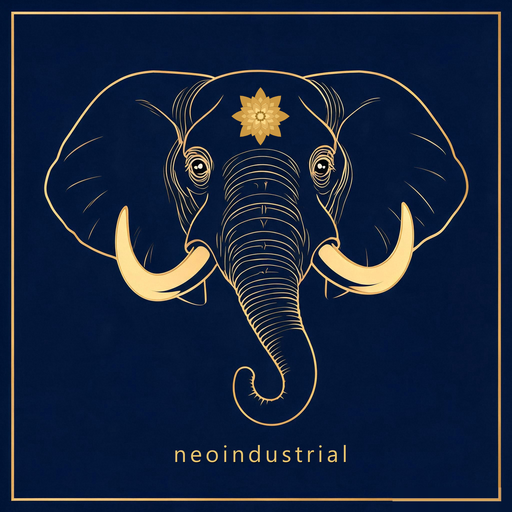
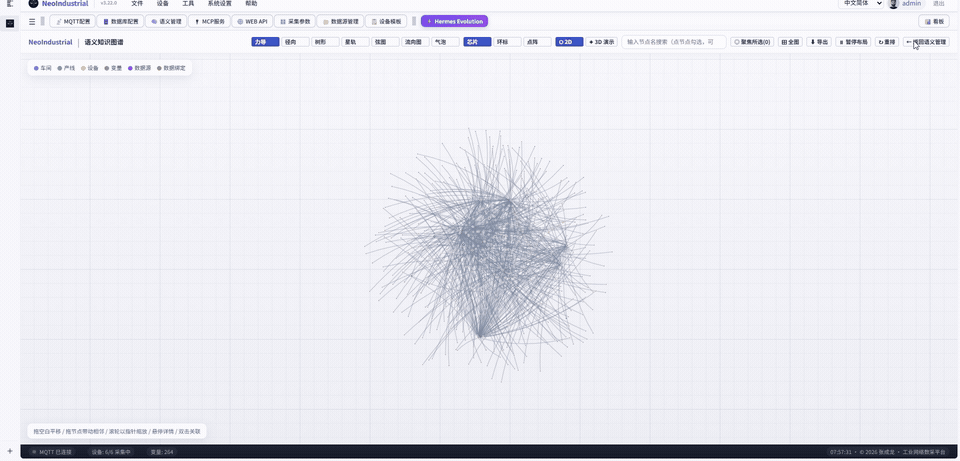
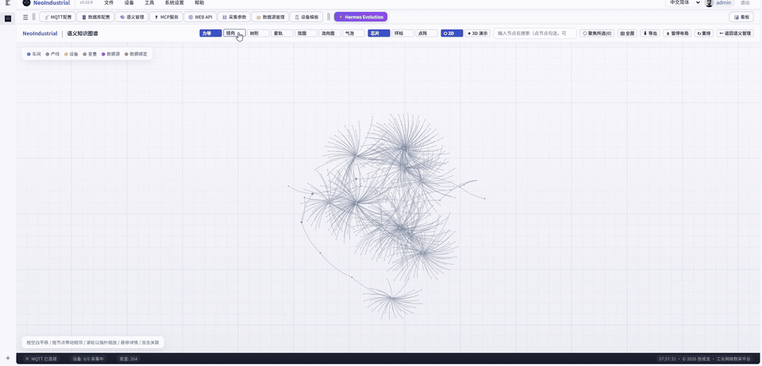
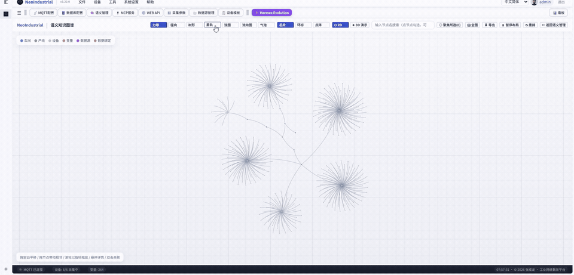
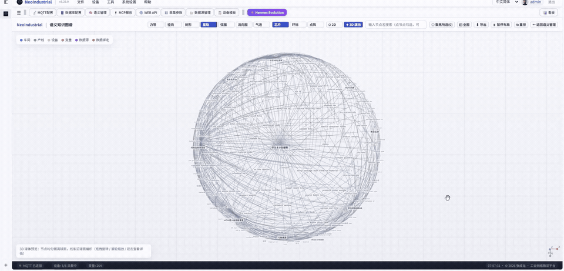
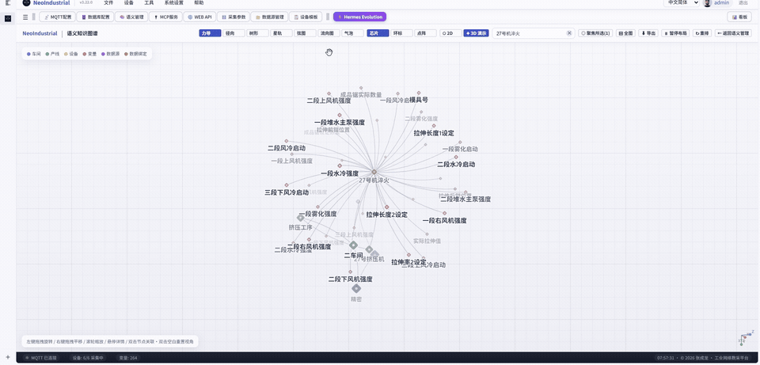
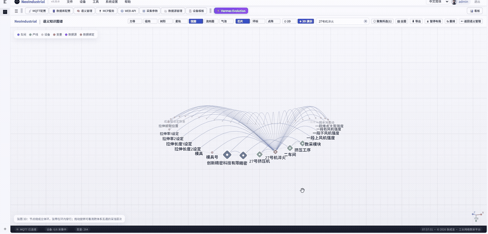
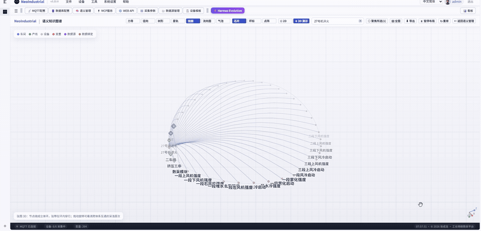
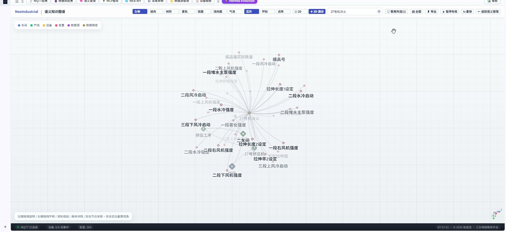

# NeoIndustrial Community Edition

[中文](README.md) | **English**

<div align="center">

**NeoIndustrial Data Acquisition Platform · Community Edition**

[](https://dotnet.microsoft.com/)
[](LICENSE)
[]()
[](https://gitee.com/JEDI_MASTER/neoIndustrial)



**MCP + Industrial Data Acquisition = World's First** · 40 protocols completely free · Millisecond MQTT to cloud · AI-native control · Industry 4.0 ready

</div>

> 📦 **This project ships in three editions**:
> **① Community Edition** (open source, free, download from Releases) ·
> **② Enterprise Edition** (client downloadable from Releases for evaluation; formal license issued by hardware ID) ·
> **③ WEB Commercial Edition** (browser platform, license by application). The table below explains all three; the Enterprise client is under "Get Started in 5 Minutes", and how to apply for the WEB edition is in the License section at the end.

---

## 🧭 Two Minutes In: Three Editions, Explained

> **One core, three forms: desktop single-machine → desktop factory-grade → browser-based platform.**
> From "get the data off the machine" to "let AI turn that data into decisions", the three editions cover three stages of plant digitalization.

| | ① Community Edition | ② Enterprise Edition | ③ WEB Commercial Edition |
|:--|:--|:--|:--|
| **Form** | Windows desktop, single machine | Windows desktop, factory-grade | **B/S server + browser** |
| **Price** | Open source, free (Apache 2.0) | Commercial license | Commercial license (priced by machine count) |
| **How to get it** | Download from Releases / build from source | Client downloadable from Releases | **Apply to the author — no public download** |
| **In one line** | The free foundation that gets industrial data off your machines | A factory-grade data OS on the desktop | **Collection → semantics → graph → AI collaboration, one unbroken chain** |
| **Its strongest card** | 40 protocol drivers · millisecond MQTT · 50 MCP AI tools | Semantic digital-twin layer · Fabric engine · dashboards · templates & cloning | All of the above + 2D/3D knowledge graph · AI multi-agent · multi-user collaboration · Xinchuang-ready |
| **Its honest weak spot** | Desktop single-machine only; no dashboards, no semantic layer, no commercial support | Still a single-machine desktop app; multi-user collaboration and web access remain unsolved | Needs a server to host it, and it is not publicly downloadable |

### ① Community Edition — the free way in

**Best for**: personal learning, single-device trials, secondary development, teaching.

**Strengths**

- **Genuinely open source under Apache 2.0** — free for commercial and non-commercial use, no feature crippling, no time bomb;
- **40 industrial protocol drivers** out of the box (PLC / CNC / power / building / semiconductor), with millisecond MQTT uplink;
- **50 MCP AI tools** + REST API, so AI can read your device data directly;
- Parallel writes to 4 databases (SQLite / MySQL / SQL Server / PostgreSQL).

**Weak spots (stated plainly)**

- **Windows desktop, single machine only** — no browser access, no multi-user concurrency;
- **No semantic layer, no dashboards, no Fabric engine** — those live in the Enterprise Edition;
- **No commercial SLA** — maintained by one person; issues go through the repo and community.

### ② Enterprise Edition — factory-grade firepower on the desktop

**Best for**: a single plant running deep on one machine, needing semantic modeling and production dashboards.

**Strengths**

- Adds the **semantic-layer digital-twin engine** on top of the Community Edition, turning "40001 = 245.6" into a variable with business meaning;
- **Fabric time-series engine (8 operators)** + **dashboard monitoring wall** + **event rule engine**;
- **Config templates · device cloning** — configure one production line, clone it to the other ten;
- **Industrial-grade reliability**: offline caching with re-send, heartbeat monitoring, exponential-backoff reconnect, multi-generation rolling config backups.

**Weak spots (stated plainly)**

- **Still a single-machine desktop app** — one operator, one PC; multi-user collaboration and remote access are not solved;
- **Requires a Windows industrial PC** — not suitable for Xinchuang Linux environments;
- **Still no knowledge graph and no AI multi-agent** — AI stops at the tool-calling level.

### ③ WEB Commercial Edition — the most advanced generation: collection → semantics → graph → AI collaboration ⭐

> If the Community and Enterprise editions solve **getting the data up**, the WEB Commercial Edition solves the **whole chain of "data → judgment → action"**.
> Very few industrial software products have this chain **fully connected end to end** — most stop after one or two links.

**Why it is ahead: one chain, all inside a single platform**

| Stage | The usual approach (buy each piece, glue them yourself) | This platform (one platform does it all) |
|:--|:--|:--|
| ① Collection | Buy Kepware / SCADA to collect data | 39 drivers on the same core, millisecond MQTT, parallel writes to 6 databases |
| ② Semantics | Keep a spreadsheet noting "what 40001 means" | Built-in industrial semantic tree + 69 variable relation types + 71 event type catalog |
| ③ Graph | Nothing (or a separate 3D visualization project) | **2D / 3D knowledge-graph visualization** with digital-twin modeling and relation tracing |
| ④ Analysis | Buy a BI tool / a time-series database | **Fabric engine with 27 hot-pluggable operators** (aggregate / correlation / anomaly / rate of change / accumulate / threshold / prediction…) |
| ⑤ Prediction | None | Trend and threshold prediction operators over historical time series |
| ⑥ Summarization | Someone writes the daily report by hand | **AI summarizes and draws conclusions automatically**, with user-defined agents by role |
| ⑦ Collaboration | Chat groups plus spreadsheets | **AI multi-agent task dispatch** + team memory / knowledge distillation / self-evolving skills |

**One platform replaces the 4–5 systems you would otherwise buy separately and glue together yourself.**

**Strengths**

- All seven stages above are **built in**;
- **Browser (B/S) access** — no per-PC client; upgrade once and the whole plant is current;
- **Three-tier permissions (organization / role / user) + audit trail** — who changed a config, who exported which data, all traceable;
- **AI-native**: 83 MCP tools + multi-agent orchestration; AI can add devices, configure variables, query history and build dashboards directly;
- **It grows with you**: AI memory, team knowledge distillation, and skills that are captured automatically and self-improve — the longer you use it, the better it knows your plant;
- **Xinchuang-ready**: a self-contained Linux x64 runtime package (no .NET install) with Dameng DM8 usable out of the box;
- **Trilingual**: Chinese / English / Vietnamese switchable at runtime, with the built-in manual in all three.

**Weak spots (stated plainly)**

- **Needs a server to host it** (or an always-on industrial PC) — it is not a double-click desktop app;
- **Not publicly downloadable** — a license must be applied for from the author, priced by machine count;
- **39 drivers** (the same core as the desktop edition, which ships 40);
- The fuller the platform, the **more first-time setup it needs** — semantics, graphs and agents all need to be fed your data.

### 📸 See it in action (screenshot / GIF slots)

<div align="center">

&nbsp;

&nbsp;

&nbsp;



**▲ Semantic-graph highlights — layout switching · 2D / 3D** (looping GIFs)

</div>

### 🎬 WEB Commercial Edition — full demo video

<div align="center">

<a href="picture/web-demo.mp4"></a>

**▶ Click the cover to watch the full demo** (1 min 53 s · 1080p)

</div>

This video is a complete walkthrough of the **WEB Commercial Edition** — from **data collection** to the **semantic knowledge graph (2D / 3D)** and the **Hermes Evolution Agent**:

- **① Data collection**: device-tree management (workshop → process → device) with per-variable configuration and custom Python post-processing scripts (e.g., sliding-window filtering) that turn raw signals into clean, production-ready data;
- **② Semantic graph 2D / 3D**: switch between force-directed, radial, tree, star, star-orbit, flow, chip and ring layouts in one click; in 3D sphere mode you can rotate and zoom to grasp the whole relationship network at a glance;
- **③ Hermes Evolution Agent**: **self-evolution** (automatic skill distillation, evolution-proposal approval, feedback-driven skill refinement) · **scheduled tasks** (report / query-summary / alert / digest jobs with custom cron, generating daily briefs and HTML boards from natural-language instructions) · **push settings** (in-site messages + email + WeCom / DingTalk / Feishu bot webhooks).

> 📺 Recorded on WEB Commercial Edition v3.22.0; best viewed at 1080p.


<!-- 📷 Slot B: industrial semantic tree / semantic management UI
     Suggested file: picture/web-00-semantic-tree.png
     Usage:  -->

<!-- 📷 Slot C: knowledge graph 2D / 3D visualization (rotate, drill down)
     Suggested file: picture/web-00-graph-3d.gif
     Usage:  -->

<!-- 📷 Slot D: AI analysis / prediction / summarization / multi-agent collaboration
     Suggested file: picture/web-00-ai-agents.gif
     Usage:  -->

---

## 🎨 The Story Behind This Software

In the spring of 2026, I was developing the UI prototypes and driver logic for a digital twin system at home.

I'm not a computer science major. I'm an **art student** — color, light, and composition are my native language. But in the digital twin world, pretty pictures alone get you nowhere: without real data flowing in, even the most gorgeous 3D model is just an exquisite empty shell.

My aluminum extrusion digital twin project is already live and iterating like crazy — trilingual (Chinese/English/Vietnamese), with AI analysis, temperature trend dashboards, extrusion cycle data automatically written to the database, data export, second-level data sync, and millimeter-level model displacement, all mirroring the live equipment on the shop floor (it may be open-sourced in the future too — stay tuned).

While building that digital twin system, I needed something that could connect to every device in the factory. PLCs, CNCs, sensors, meters, power cabinets, building controllers... they all speak completely different languages: Modbus, S7, FOCAS, BACnet, IEC 61850... The options out there were either absurdly expensive (one Kepware license costs as much as a machine tool), too heavy for an industrial PC to run (installing Ignition takes longer than building the production line), or so old they had never even heard of AI.

**I couldn't find anything usable. So I put down the brush and opened Visual Studio.**

(Some background: I joined a steel plant right after graduation, and have now spent 3 years in the aluminum extrusion industry — 12 years in IT in total.)

In under three months, one person — one art student — built from scratch: 40 industrial protocol drivers, parallel writes to 4 kinds of databases, MQTT two-layer millisecond push, 50 MCP AI atomic tools, a REST API, and a dashboard monitoring wall. Not to prove anything — I simply needed a set of nerve endings that could connect to every industrial device, to bring the digital twin to life.

**This is not "yet another piece of industrial software". This is the data foundation an art student built for the digital twin world.**

Now, I'm open-sourcing the Community Edition in full — Apache 2.0, permanently and genuinely free.

Because I know how hard it is to do open-source industrial software in China. When you're walking alone through the workshop at midnight, with nothing but the PLC indicator lights blinking, what you need is not more paywalls and gatekeeping — it's a tool that works, that's sincere, and that asks for nothing in return.

I hope you like it. I hope it's useful. And to friends hoping to transition from art/design/frontend into IT: I sincerely hope this software helps you get there.

---


## 📖 Why Choose It

This is not another Modbus debugging tool.

IndustrialDataCollector is a **production-grade industrial data acquisition engine** — rock-solid, and already running on real production floors.

From PLCs in stamping workshops to IEC 61850 substations at offshore wind farms, from Fanuc controllers on 5-axis CNC machining centers to semiconductor SECS/GEM tools — **one codebase covers them all.**

40 drivers, 4 databases, MQTT two-layer topic push, 50 MCP AI atomic tools — zero barriers to getting started. No encryption, no authentication, no license.

**The Community Edition is open source under Apache 2.0, free forever.**

You should spend your time on process optimization and business-scenario analysis — not on the nonsense of "who can connect to whom".

---

 **Conversational AI for real-time data, adding devices and variables, and historical data analysis** 


## 🧠 Architecture at a Glance

```
┌─────────────┐    ┌─────────────┐    ┌─────────────┐
│  PLC / CNC  │    │  Sensors &  │    │  Power &    │
│ 40 protocols│    │  Meters     │    │  Building   │
│             │    │ Modbus RTU  │    │ BACnet/DLT  │
└──────┬──────┘    └──────┬──────┘    └──────┬──────┘
       │                  │                  │
       └──────────────────┼──────────────────┘
                          ▼
              ┌───────────────────────┐
              │  DataCollectionEngine │
              │ millisecond polling · │
              │ adaptive byte order   │
              └───────────┬───────────┘
                          │
          ┌───────────────┼───────────────┐
          ▼               ▼               ▼
   ┌──────────┐   ┌──────────┐   ┌──────────────┐
   │   MQTT   │   │  4 DBs   │   │  MCP / REST  │
   │  ms push │   │ parallel │   │ AI data plane│
   └──────────┘   └──────────┘   └──────────────┘
```


## ✨ Core Capabilities

| Module | Community Edition |
|------|:---:|
| 🔌 **40 industrial protocol drivers** — PLC / CNC / meters / building / power / semiconductor | ✅ |
| 📡 **MQTT two-layer topics** — bulk JSON + per-variable subtopics, Sparkplug B compatible | ✅ |
| 🗄️ **Parallel writes to 4 databases** — SQLite / MySQL / SQL Server / PostgreSQL | ✅ |
| 🤖 **50 tools over MCP** — AI manages devices, queries data, and starts/stops collection in natural language | ✅ |
| 🔄 **REST API** — HTTP real-time data queries with Bearer Token authentication | ✅ |
| 📊 **Bulk CSV management** — Excel-compatible UTF-8, one-click import/export of data points | ✅ |
| 🌍 **Bilingual UI (Chinese/English)** — switch at runtime without restart | ✅ |
| 🧪 **Simulator driver** — 20+ simulated variables, run the full pipeline with no hardware | ✅ |
| 🚀 **Zero barriers** — no encryption, no authentication, no license, no hardware lock; unzip and run | ✅ |

Device management:


Device configuration:


## 🔌 The Complete List of 40 Protocol Drivers

> ⚠️ **Drivers that require a license — please read first**
>
> **All 39 drivers built into the WEB Commercial Edition are open-source implementations**, and the runtime libraries shipped with the package are under open-source licences too. **The platform does not ship, bundle or pre-install any commercial-licensed driver that must be bought from a vendor.**
>
> If a device on site needs a commercially licensed driver, there are two routes: **① upload it yourself** — upload the driver you have purchased and licensed (`.dll` / `.zip`) in "Driver management", choosing its category; **② let the AI add it** — ask the built-in AI to search online for candidates; it states the source and licence and installs only after you agree. **The licence itself must still be obtained by the user — the platform only loads the driver, it never resells or cracks anything.**
>
> The drivers marked 🔑 below are governed by **commercial licenses or membership terms from the original vendor or the standards body**. **Before production, commercial or customer-facing use, contact the vendor or licensing body, purchase a legitimate license and obtain formal permission.** Without a license, use them for learning, research and evaluation only.
>
> This software only implements protocol connectivity. It does **not** bundle, resell, crack or redistribute any vendor SDK, license file, license key or licensed feature option, and does not act as an agent for any vendor licensing.
>
> | 🔑 Licensed drivers | Who to contact | Typical license form |
> |---|---|---|
> | Fanuc FOCAS | FANUC or an authorized distributor | FOCAS library license (agreement required) |
> | Heidenhain (Remo Tools / DNC) | HEIDENHAIN | Paid machine DNC / Remo option |
> | Siemens 840D (OPC UA / Access MyMachine) | SIEMENS | Paid CNC runtime option |
> | SECS/GEM | SEMI (standards must be purchased) + the vendor SDK you use | Standards documents + vendor SDK |
> | OPC DA | The third-party OPC server vendor you connect to | Commercial OPC server license |
> | HART IP | FieldComm Group | Membership / specification license |
> | EtherNet/IP / DeviceNet | ODVA | Membership + specification subscription |
> | CC-Link | CC-Link Partner Association (CLPA) | Membership / specification license |
> | KNX | KNX Association | Membership (specifications are member-only) |
> | DLMS/COSEM | DLMS User Association | Membership (specifications are member-only) |
> | LonWorks | LonMark International / licensors | Membership / specification license |
>
> **Unmarked drivers** (Modbus, Siemens S7, Mitsubishi MC/FX, Keyence KV, Panasonic Mewtocol, Omron FINS/HostLink, Beckhoff ADS, CODESYS, Haas, Mazak, MTConnect, PROFIBUS, PROFINET, BACnet, OPC UA, IEC 104/61850, DNP3, DALI, M-Bus, MQTT, Sparkplug B, HTTP REST, etc.) are implemented from open specifications and normally require no vendor license to implement: **MTConnect is documented by its owner as an open, royalty-free standard**, **PI states explicitly that PI membership is not required to implement PROFINET/PROFIBUS**, and **Beckhoff permits royalty-free redistribution of the unmodified ADS DLLs**. For some protocols the **standards documents themselves must be purchased or are member-only** (e.g. ASHRAE 135 / BACnet, IEC 62386 / DALI, EN 13757 / M-Bus, IEC 61850 / IEC 104, IEEE 1815 / DNP3) — but buying the specification is enough to implement; no vendor license fee is involved. **Whether a license is required is ultimately governed by the vendor's and standards body's current terms — this table is a heads-up only.**
>
> **Compliance & responsibility**: users must verify and obtain all licenses and permissions required for the devices and protocols they use. This software is provided "as is" with no warranty regarding third-party protocol licensing; any liability or dispute arising from the use of such protocols without a license rests with the user.

### ⚙️ PLC / Controllers (11)
| Driver | Supported brands/protocols |
|------|---------------|
| **Modbus TCP** | Schneider, Siemens, Mitsubishi, Delta, Inovance, Xinje, and all devices supporting Modbus TCP |
| **Modbus RTU** | Serial RS-232/485, same as above |
| **Siemens S7** | S7-200/300/400/1200/1500, supporting DB/Input/Output/Merker areas |
| **Siemens 840D** 🔑 | Direct connection to Sinumerik 840D/840Di CNC systems |
| **Beckhoff ADS** | The full TwinCAT 2/3 range |
| **CODESYS** | CODESYS V3+ compatible controllers (Beckhoff, Hollysys, Inovance, etc.) |
| **Mitsubishi FX** | FX1S/1N/2N/3U/5U series |
| **Mitsubishi MELSEC** | iQ-R/iQ-F/Q/L series (MC protocol) |
| **Keyence KV** | KV-5000/7000/8000 series |
| **Panasonic Mewtocol** | The full FP series |
| **Omron FINS / HostLink** | The full CJ/CS/CP range |

### 🔧 CNC Machine Tools (4)
| Driver | Description |
|------|------|
| **Fanuc FOCAS** 🔑 | 0i/16i/18i/21i/30i/31i/32i — read/write macro variables + spindle load + alarm numbers |
| **Haas CNC** | The full NGC controller range |
| **Mazak** | Mazatrol controllers (Smooth series) |
| **Heidenhain** 🔑 | TNC series (HEIDENHAIN Remo Tools) |

### 🌐 Industrial Ethernet (3)
**EtherNet/IP** 🔑 — Rockwell AB ControlLogix/CompactLogix · **Profinet** — Siemens PROFINET IO · **OPC UA** — cross-platform data modeling

### 🔗 Field Buses (3)
**PROFIBUS** — Siemens PROFIBUS DP · **DeviceNet** 🔑 — Allen-Bradley · **CC-Link** 🔑 — Mitsubishi

### ⚡ Power / Energy (3)
**IEC 104** — power telecontrol protocol · **IEC 61850** — smart substations · **DNP3** — North American power SCADA

### 🏢 Building Automation (5)
**BACnet** — Honeywell/Johnson Controls/Siemens building control · **KNX** 🔑 — smart building bus · **DALI** — digital addressable lighting · **LonWorks** 🔑 — building control networks · **MBus** — heat/water/electricity meters

### ☁️ IoT / Semiconductor / Others (11)
| Driver | Description |
|------|------|
| **MQTT Subscribe** | Subscribe to third-party MQTT brokers (reverse acquisition) |
| **Sparkplug B** | Industrial IoT MQTT sub-protocol |
| **HTTP REST** | Poll and collect from RESTful JSON APIs |
| **DLMS/COSEM** 🔑 | International standard for smart meters |
| **HART IP** 🔑 | IP variant of HART instruments |
| **MTConnect** | CNC machine connectivity standard |
| **SECS/GEM** 🔑 | Semiconductor equipment communication standard |
| **OPC DA** 🔑 | Classic OPC Data Access |
| **OPC UA PubSub** | OPC UA publish/subscribe mode |
| **Simulator** | Built-in 20+ simulated variables (sine wave/square wave/random/increment) |

> 🔑 **= this driver requires a legitimate license from the original vendor / standards body, obtained in advance, before production or commercial use.** This software does not provide, resell, crack or bundle any vendor SDK or license file; without a license, use it for learning, research and testing only.


---

## 🚀 Get Started in 5 Minutes

### Requirements
- Windows 7 SP1+ / Windows Server 2008 R2+
- .NET Framework 4.8 ([official Microsoft download](https://dotnet.microsoft.com/download/dotnet-framework/net48))
- 4 GB+ RAM

### Installation

> ⚠️ **If you downloaded the zip, read this first!** Windows marks downloaded files as unsafe, which breaks the VS build.

**⬇️ Download the Enterprise Edition client (no install, unzip and run)**

The Enterprise Edition client is available for direct download — License (obtain via email at bottom), no build required:

> 📦 Enterprise Client (latest, unzip & run) download:
> [GitHub Releases](https://github.com/18354356258/NeoIndustrial/releases)　|　[Gitee Releases](https://gitee.com/JEDI_MASTER/neoIndustrial/releases)
>
> Community edition source & client packages are available on the same Releases page.

- Unzip and run `IndustrialDataCollection.exe` to start (pre-built — no installation, no Visual Studio needed)
- Bilingual language pack (Chinese/English) built in; if Windows SmartScreen blocks the first launch, click "Run anyway"

**Option 1: Download the Release package (recommended, no build needed)**

Go to [Releases](https://gitee.com/JEDI_MASTER/neoIndustrial/releases), download the latest zip, unzip it, and **double-click `setup.bat`** (removes the web mark + restores NuGet packages), then open the `.sln` in Visual Studio and build.

Or run `Release/IndustrialDataCollector.exe` directly (pre-built, no VS needed).

**Option 2: Git clone**

```bash
git clone https://gitee.com/JEDI_MASTER/neoIndustrial.git
cd IndustrialDataCollector
setup.bat          # One-click NuGet restore
```

Then open `IndustrialDataCollector.sln` in Visual Studio 2019+ → Build → Run.

> If `setup.bat` won't run, do these two steps manually:
> 1. Run PowerShell as administrator: `Get-ChildItem -Recurse | Unblock-File`
> 2. In Visual Studio: right-click the solution → Restore NuGet Packages

### Your First Collection Task (Simulator mode, no hardware needed)

1. Launch `IndustrialDataCollector.exe`
2. In the device tree on the left, right-click → **Add Device** → choose the `Simulator` driver
3. Click **CSV Import** → use the simulator's default variables → Save
4. Click **▶ Start Collection**
5. Watch the data start rolling in

### Connecting Real Devices

| Device type | Key configuration |
|----------|---------|
| Modbus TCP PLC | IP + port 502 + register address + data type |
| Siemens S7-1200 | IP + Rack=0 Slot=1 + DB address (e.g. DB1.0.0) |
| Fanuc CNC | IP + port 8193 + macro variable number |
| MQTT Broker | Broker address + port + topic prefix |

---

## 📖 User Manual

### Device Management (4-Level Hierarchy)

The platform organizes devices in a **Company → Workshop → Process → Device** tree:

- **Right-click any tree node** → add/rename/delete folders or devices
- **Drag & drop** → move devices to another process/workshop, or migrate whole folders
- **Search box** → live filtering by device name or IP
- **Right-click "Move to..."** → precise relocation via a path-picker dialog

### Data Point Configuration (every single variable can be individually cleaned, configured, semantically tagged, alarmed... if a business scenario needs it, it should be here... and if something's missing, speak up and we'll figure it out together)


Basic info:


Data point alarms:


Custom scripts:


Edge computing:


Advanced calculation:


Each device hosts data points that define what to collect and how to process it:

| Field | Description |
|------|------|
| Variable name | Chinese/English label (e.g. `Temperature Sensor`) |
| Address | Protocol-specific address (e.g. Modbus `40001`, S7 `DB1.0.0`) |
| Data type | int16 / uint16 / int32 / float32 / double / string... |
| Byte order | ABCD (big-endian) / DCBA (little-endian) / BADC / CDAB |
| Linear scaling | `y = kx + b`: raw value × k + b = engineering value |
| Rounding | Keep N decimal places |
| Alarm thresholds | HH / H / L / LL four-level settings |
| Unit | Engineering unit (℃, MPa, rpm, mm...) |

### MQTT Data Format

Each collection cycle sends one JSON packet to `{TopicPrefix}/{DeviceName}`:

```json
{
  "timestamp": "2026-07-16T14:30:00.123",
  "driver": "Simulator",
  "device": "Extruder #28",
  "values": [
    {"id": "temperature", "dt": "float32", "v": 245.6, "u": "℃"},
    {"id": "pressure", "dt": "float32", "v": 32.1, "u": "MPa"}
  ]
}
```

Meanwhile, each variable also gets its own subtopic `{TopicPrefix}/{DeviceName}/temperature` pushing the single value.

### Database Configuration


| Database | Connection string example | Auto table creation |
|--------|-----------|:---:|
| SQLite | Defaults to `Data/industrial.db` | ✅ |
| MySQL | `Server=192.168.1.100;Database=idc;User=root;Password=***` | ✅ |
| SQL Server | `Server=.;Database=idc;Integrated Security=True;` | ✅ |
| PostgreSQL | `Host=192.168.1.100;Database=idc;Username=postgres;Password=***` | ✅ |

All four databases share the same table schema: `industrial_data(id, db_type, device, variable, data_type, value, unit, timestamp)`

### MCP AI Integration

The platform ships with a built-in MCP Server exposing 50 AI-callable tools. Any MCP-capable AI client (Claude Desktop, etc.) can connect and then control devices in natural language:

```
User: Add a Mitsubishi FX5U PLC at IP 192.168.1.50, collecting D100 (temperature) and D101 (pressure)
AI:   calls add_device → add_variables → reload_config → device online
```

Tool coverage: device CRUD · variable management · collection start/stop · real-time queries · database queries · data source management

### CSV Bulk Import Template

CSV format (UTF-8, editable directly in Excel):

| Variable | Address | Data type | Unit | Rounding | Scale K | Scale B | HH | H | L | LL |
|--------|------|----------|------|------|-------|-------|----|---|---|----|
| Main Motor Current | 40001 | float32 | A | 2 | 0.1 | 0 | 500 | 450 | 50 | 10 |
| Temperature Sensor | 40003 | int16 | ℃ | 1 | 1 | 0 | 300 | 250 | -10 | -20 |

A template file ships with the desktop app: `变量点模板_ModbusTCP.csv` (Data Point Template - Modbus TCP)

### Logging & Troubleshooting

- Log directory: `Logs/log_YYYYMMDD.txt`
- Default level is **Info** (start/stop/errors/API requests) — no log spam
- To troubleshoot collection details, set `LogLevel.Debug` in `Logger.cs` to restore full logging
- Logs older than 30 days are cleaned up automatically

---

## 🆚 Enterprise Edition — Full Firepower for the Whole Factory

> **Don't measure the Enterprise Edition with the Community Edition's ruler — these are two entirely different weapon systems.**
>
> The Community Edition helps you **connect to devices**. The Enterprise Edition helps you **run the entire factory**. Every item below is a heavy-duty capability designed from the ground up for large industrial scenarios — none of them exist in the Community Edition:

### 🧬 Semantic Layer · Digital Twin Engine


> Turn "40001 = 245.6" into "Extrusion Workshop #3 ▶ Line 1 ▶ Main Machine ▶ barrel temperature running high — recommend checking cooling pump #3"

- **Automatic modeling** — the device tree and data source tree mirror each other; drag-to-reorganize instantly updates the digital twin topology
- **Tag system** — a unified variable namespace across devices and protocols; one TAG standard across the entire plant
- **Relationship graph** — device→variable→data source, three-way linkage; AI can trace any datum from "source device → collection driver → database table → MQTT topic"
- **State tracking** — online/offline/disabled/deleted four-state markers; AI knows what's alive, what's dead, and when it died
- **Variable events** — derived metrics such as rate, accumulation, and duration are computed automatically

### ⚡ Fabric Time-Series Analysis Engine

> 8 hot-pluggable operators — 10× faster than SQL, 100× less effort than writing Python scripts

| Operator | Function | Industrial use case |
|------|------|---------|
| **Aggregate** | Windowed aggregation (avg/max/min/sum/count/stddev) | Hourly average temperature, daily peak power |
| **Correlation** | Multi-variable Pearson correlation | Correlation diagnosis between vibration and temperature |
| **Anomaly** | 3-sigma / IQR outlier detection | Sudden spikes, sensor drift |
| **Digital Twin** | Deviation between theoretical and measured values | Energy benchmarking, efficiency decay |
| **Rate** | Rate of change d/dt | Temperature rise rate, pressure change rate |
| **Accumulate** | Cumulative totals (integration) | Total output, total energy, total runtime |
| **Threshold** | Dynamic upper/lower limit checks | Adaptive process-window alarms |
| **Prediction** | Linear regression trend forecasting | Predictive maintenance, spare-parts early warning |

Analysis results land in the database alongside the raw data, and can be queried in real time by the MCP AI tools.

### 🎛️ Dashboard

- Factory-level real-time monitoring wall, with device/production line/workshop three-level drill-down
- Trend curves + alarm panel + device status matrix
- Four-color alarm grading (HH red / H orange / L blue / LL purple) + 20-minute time window + incremental row updates with no screen flicker
- Supports independent multi-monitor wall display

### 📦 Templates · Cloning · Bulk Deployment

- **Configuration templates** — export a device's complete configuration (driver + variables + alarm parameters + MQTT topics) as a template
- **One-click cloning** — pick a template → enter the IP → 10 identical devices, configured
- **Differentiated overrides** — after applying a template in bulk, each device can still be tuned individually, with no interference
- Deploying a hundred devices: from 2 hours down to 2 minutes

### 🗄️ TDengine Time-Series Database

- Columnar storage optimized for industrial time series, 100K points/second writes
- Auto-partitioned super tables; 10 years of data queryable in seconds
- Compression ratio 10:1–20:1 — GBs of data shrink to MBs on disk
- 4 hard-won lessons are baked into MCP `introduce_platform("tdengine")`, so AI automatically avoids the pitfalls

### 🛡️ Industrial-Grade Reliability

| Capability | Description |
|------|------|
| **Offline caching** | When the network drops, data is written to local SQLite; after recovery, MQTT is re-sent and the database backfilled automatically |
| **Heartbeat monitoring** | Independent heartbeat per device; records state transitions only, no disk spam |
| **Exponential backoff reconnect** | Consecutive failures back off 1→2→4→8→16→32→60s, auto-reset on success |
| **Multi-generation config backups** | `config.json.bak.1~50` — up to 50 generations to roll back to |
| **Event rule engine** | Condition→action (MQTT/DB/alarm): IF `temperature>300` THEN `send MQTT + write DB + raise alarm` |
| **Authentication & security** | SHA256+SALT passwords + MAC hardware binding + Token authentication |

### 📊 Full Comparison

| Capability | Community Edition | Enterprise Edition | WEB Commercial Edition |
|----------|:---:|:---:|:---:|
| Industrial protocol drivers (PLC / CNC / power / building / semiconductor) | 40 | 40 | 39 (same core, **all open-source implementations**) |
| MQTT millisecond push | ✅ | ✅ | ✅ |
| SQLite / MySQL / SQL Server / PostgreSQL | ✅ | ✅ | ✅ |
| TDengine time-series database | ❌ | ✅ | ✅ |
| Dameng DM8 (domestic database) | ❌ | ❌ | ✅ |
| MCP AI tools | 50 | 50 | **147** |
| **Driver management (categories / upload / AI-added)** | ❌ | ❌ | ✅ |
| REST API | ✅ | ✅ | ✅ |
| CSV bulk import/export | ✅ | ✅ | ✅ |
| UI languages | Chinese / English | Chinese / English | Chinese / English / Vietnamese (+ built-in manual) |
| **Semantic-layer digital twin modeling** | ❌ | ✅ | ✅ |
| **2D / 3D knowledge-graph visualization** | ❌ | ❌ | ✅ |
| **Fabric time-series engine** | ❌ | ✅ (8 operators) | ✅ (27 operators) |
| **Dashboard monitoring wall** | ❌ | ✅ | ✅ |
| **Config templates · device cloning** | ❌ | ✅ | ✅ |
| **Offline caching · re-send** | ❌ | ✅ | ✅ |
| **Event rule engine** | ❌ | ✅ | ✅ |
| **Auth · hardware binding · Token** | ❌ | ✅ | ✅ |
| **Multi-user online collaboration · audit trail** | ❌ | ❌ | ✅ |
| **AI multi-agent · memory & self-evolving skills** | ❌ | ❌ | ✅ |
| **Browser (B/S) access — no per-PC install** | ❌ | ❌ | ✅ |
| **Xinchuang Linux support (self-contained package)** | ❌ | ❌ | ✅ |
| **Multi-generation rolling config backups** | ❌ | ✅ | ✅ |
| **Commercial license · technical support** | ❌ | ✅ | ✅ |

> 🔥 **The Enterprise Edition is not the Community Edition "with extras" — it is a redesigned, factory-grade data operating system.**
> 🌐 **The WEB Commercial Edition goes further: it moves that operating system into the browser, then grows multi-user collaboration, AI multi-agent orchestration and a 2D/3D knowledge graph on top — see the next section.**

---

## 🌐 WEB Commercial Edition — The Whole Factory in a Browser

> The Community and Enterprise editions are software installed on an industrial PC. The WEB Commercial Edition is an industrial data operating system that lives on a server.
>
> The same protocol driver core, plus B/S multi-user collaboration, AI multi-agent orchestration and 2D/3D industrial semantics. It is not a port of the desktop edition — it is a redesigned, web-native platform.

<!-- 📷 Screenshot slot 1: WEB Commercial Edition · login page / home overview
     Suggested file: picture/web-01-login.png
     Usage:  -->

### What it solves that the desktop edition cannot

- **One industrial PC → one network**: open a browser and go. No per-machine installs; upgrade once and the whole plant is on the new version.
- **One operator → a whole team online**: three-tier permissions (organization / role / user) with concurrent access; who changed a config, who exported which data — everything is logged and auditable.
- **AI as an add-on → AI-native**: a built-in AI chat workspace with multi-agent orchestration. AI operates the platform directly — add devices, configure variables, query historical data, build dashboards — and agents can dispatch tasks to one another.
- **Forgets you → learns you**: AI memory, team knowledge distillation, and skills that are captured automatically and self-improve. The longer you use it, the better it understands your plant and your process.
- **Flat tables → 2D/3D knowledge graph**: an industrial semantic tree plus relationship-graph visualization turns "40001 = 245.6" into a digital twin you can see, click into, and trace.

<!-- 📷 Screenshot slot 2: WEB Commercial Edition · AI chat / multi-agent collaboration
     Suggested file: picture/web-02-ai-agents.png
     Usage:  -->

### Core capabilities

| Capability | Details |
|------|------|
| 🔌 Industrial protocol drivers | **39** production-ready drivers built in, **all of them open-source implementations** (PLC / CNC / power / building / semiconductor / meters), sharing the same core as the desktop edition; organized into 7 driver categories — pick the category first, then the driver |
| 🧩 Driver management | A single driver inventory: driver / category / source / provider / size / installed at / status, filterable by keyword, source and category. **Commercial-licensed drivers you have purchased, or open-source drivers, can be uploaded by you**; built-in drivers can be disabled and restored, plugin drivers can be deleted |
| 🤖 AI adds drivers | For a protocol the platform does not have, just ask the built-in AI to search online: it explains the source and the license, and installs into the category you choose once you agree. The source URL and time are recorded server-side, and the inventory marks it "Added by AI" |
| 🗄️ Parallel database writes | 6 kinds: SQLite / MySQL / SQL Server / PostgreSQL / TDengine / Dameng DM8 (domestic, Xinchuang-ready) |
| 🤖 MCP atomic tools | **147** AI-callable tools (137 visible to the built-in AI chat, 57 of them writable), covering device collection & control, collection drivers, data sources, offline cache, Fabric time-series analysis and industrial semantics |
| 🧠 AI multi-agent | Built-in chat workspace; create your own agents, grant each one a capability boundary, and let them collaborate by dispatching tasks |
| 🔬 Fabric time-series engine | 27 hot-pluggable operators: aggregate / correlation / anomaly / digital-twin benchmarking / rate / accumulate / threshold / prediction… |
| 🕸️ Industrial semantics & knowledge graph | Semantic tree + 69 variable relation types + 71 event type catalog, with 2D/3D graph visualization |
| 📊 Dashboards · alarms · scheduled jobs | Real-time monitoring wall, 4-level alarms, scheduled reports, in-app messages and a document workspace |
| 👥 Permissions & audit | Three-tier permissions (organization / role / user), user activity tracing, system logs, hardware management |
| 🌍 Trilingual | Chinese / English / Vietnamese, switchable at runtime, with the built-in product manual in all three |
| 🧩 Xinchuang-ready | A self-contained Linux x64 runtime package (no .NET install required), with Dameng DM8 usable out of the box |
| 🚀 Deployment | Runs on a single machine; .NET 8 + Blazor, browser access, no client install on every PC |

### 🔌 Driver categories & driver management (v3.22.5)

Connecting a device is a two-level choice — **category first, then driver** — and the collection page and the driver management page share one category definition:

| Category | Covers | Built-in drivers |
|------|------|:---:|
| Industrial common | General industrial protocols, simulator | 8 |
| PLC / industrial control | Mainstream PLCs and controllers | 8 |
| CNC | Machine tools and CNC systems | 6 |
| Building automation | HVAC, lighting, meters | 4 |
| Power / energy | Power protocols and metering | 5 |
| Semiconductor | Semiconductor and fieldbuses | 3 |
| General / other | HTTP, OPC, SNMP, etc. | 5 |

What the driver management page does:

- **One inventory** — driver / category / source / provider / size / installed at / status / actions, filterable by keyword, source and category;
- **Upload assigns the category** — uploading a `.dll` or `.zip` (≤100 MB) requires choosing the category first, so the driver lands exactly where it belongs;
- **Re-categorise in place** — a plugin driver's category can be switched right in the list;
- **Built-in drivers can be disabled / restored, plugin drivers deleted** — built-in drivers ship with the program (their code cannot be deleted) and can be disabled and restored; uploaded plugins can be removed together with their folder;
- **Added by AI** — for a protocol the platform lacks, ask the AI to search online, explain the source and licence, and install into the chosen category once you agree (marked "Added by AI"; source URL and timestamp are recorded server-side, not self-reported by the AI).

<!-- 📷 Screenshot slot 3: WEB Commercial Edition · industrial knowledge graph (2D / 3D)
     Suggested file: picture/web-03-graph.png
     Usage:  -->

<!-- 📷 Screenshot slot 4: WEB Commercial Edition · dashboards / semantic management
     Suggested file: picture/web-04-dashboard.png
     Usage:  -->

### Which edition should you choose?

| Your scenario | Recommended edition |
|----------|----------|
| Personal learning / single-device trial / secondary development | **Community Edition** — Apache 2.0, free, download from Releases |
| Single plant, single machine, deep desktop use, semantic layer + dashboards | **Enterprise Edition** — client downloadable from Releases; formal license issued by hardware ID |
| Multi-user online collaboration, plant-wide governance, AI multi-agent, Xinchuang environments | **WEB Commercial Edition** — apply to the author (licensed by device/machine count) |

### How to get it (important)

- **Community Edition**: download from this repository's Releases, or clone the source and build it (Apache 2.0, free).
- **Enterprise Edition**: the client is **freely downloadable from the Releases page** for evaluation; for a formal license, send your hardware ID by email.
- **WEB Commercial Edition**: **no public download**. A license must be applied for directly from the author, priced by device/machine count.

**To apply for a WEB Commercial Edition license, please state the following five items in your email or call:**

1. **Use case** — which industry, which production line, and what problem you want to solve;
2. **Applicant** — a company or an individual;
3. **Intended purpose** — in-house production / project delivery / teaching & research / secondary development…;
4. **License period** — the expected term and go-live date;
5. **Number of devices** — how many devices or machines you need to manage.

📮 Email: `751326339@qq.com`　📞 Phone: `18354356258` / `18854344113` (Zhang Chenglong, WeChat available)

<!-- 📷 Screenshot slot 5: WEB Commercial Edition · licensing & contact (optional)
     Suggested file: picture/web-05-contact.png -->

---

## 🧑‍💻 About the Author

**Zhang Chenglong** — art student turned full-stack developer, digital twin system architect.

A one-man army. From UI prototypes to low-level protocol stacks, from frontend dashboards to backend time-series engines, from database schema design to integrating 40 industrial protocols — all of it done alone.

Why open source? Because I know how hard it is, in China, for an engineer to install a usable data acquisition program on their own industrial PC for free. You either get scared off by resellers' sky-high license fees, hold your nose and use pirated software, or spend two months wrestling with a patchwork of open-source components that still can't connect to your devices.

**It shouldn't be this way.** Industrial data acquisition is the most fundamental bedrock of digital twins and smart manufacturing — bedrock shouldn't cost money, shouldn't be encrypted, and shouldn't be locked away. So I'm putting it out there, open-sourced, clean and simple. You don't pay a cent, you don't need to contact me for a license, you don't need anyone's approval — download, build, connect your devices. That's it.

This is the Neo Industrial Data Acquisition Platform. **The data foundation of the digital twin.**

---

## 🧠 Why It Kicks Ass

Others sell "protocol converters". We built an **industrial data operating system** — and the gap between those two phrases fits in one sentence:

> Others connect you to your devices. We let AI run your entire factory for you.

### Where It's Ahead of the Curve

| Dimension | Industry status quo (2026) | Neo Industrial Data Platform |
|------|-----------------|-----------------|
| **AI integration** | Still "discussing" AI + industry | **50 MCP atomic tools, AI-native control** — Claude directly adds devices, edits configuration, queries data, and diagnoses faults for you |
| **Protocol coverage** | Single category (PLC-only / CNC-only) | **40 protocols across all categories** — PLC + CNC + power + building + semiconductor + meters, one package |
| **Digital twin** | Buy an extra platform + model manually | **Semantic-layer automatic modeling** — drag the device tree and the twin updates; the tag system is AI-reasonable |
| **Time-series analysis** | Write Python scripts / SQL | **Fabric: 8 hot-pluggable operators** — anomaly detection, correlation analysis, trend prediction; configure and it works |
| **Data egress** | Locked into the vendor's own platform | **Everything open** — MQTT + REST API + MCP; your data goes wherever you want |
| **Deployment barrier** | Servers / clusters / K8s | **Single exe, unzip and run** — one industrial PC handles 100 devices, no ops team required |

### One Person vs. the Industry Giants

This system is the work of one person. Compare it with similar offerings in the industry:

- **Kepware** (PTC, $5000+/year) — comparable driver count, but no database writes, no MQTT two-layer topics, no AI integration, no dashboard
- **Ignition** (Inductive Automation, $20,000+ to start) — powerful but heavy as an elephant; needs Java + a database + a web server; not built for industrial PCs
- **KingView / ForceControl / ZijinBridge** (组态王 / 力控 / 紫金桥) — steep learning curves, aging protocol libraries, no MCP/AI; basically stuck in 2010
- **Node-RED / ThingsBoard** — a cobbled-together feel; industrial protocol support relies on community plugins left to fend for themselves; offline reconnection logic is essentially absent

**Neo isn't trying to be anyone's competitor. It fills the piece the digital twin world is missing — the data foundation for industrial devices.**

---

## 📋 Version History

### v3.22.5 | 2026-09-19 — Driver management: driver categories + AI-added drivers (WEB Commercial Edition)

- **Driver categories** — 7 categories (industrial common / PLC & industrial control / CNC / building automation / power & energy / semiconductor / general & other); pick the category first when connecting a device, uploads must declare a category, and the list can be filtered or re-categorised in place
- **Driver management** — all 39 built-in drivers are open source; the inventory shows category / source / provider / size / installed at / status; built-in drivers can be disabled and restored, plugin drivers deleted; purchased commercial-licensed or open-source drivers can be uploaded directly
- **AI-added drivers** — the AI searches online for candidates, states the source and licence, and installs into the chosen category after confirmation; the inventory marks it "Added by AI" and the source and timestamp are recorded server-side
- **147 MCP tools** (137 visible to the built-in AI chat, 57 writable)

### v1.0.0 | 2026-07-16 — First Community Edition release

- **40 industrial protocol drivers** — Modbus / Siemens S7 / OPC UA / BACnet / EtherNet/IP / Profinet / PROFIBUS / Beckhoff / CODESYS / Mitsubishi / Fanuc / IEC 104 61850 / DNP3 / KNX / DALI / SECS/GEM / MTConnect, and more
- **Parallel writes to 4 databases** — SQLite / MySQL / SQL Server / PostgreSQL
- **MQTT two-layer topics** — bulk JSON + per-variable subtopic push
- **50 tools over the MCP protocol** — AI can directly manage devices, query data, and control start/stop
- **REST API** — HTTP real-time data query interface
- **CSV bulk import/export** — Excel-compatible UTF-8
- **Bilingual Chinese/English** — runtime switching, no restart required
- **Simulator driver** — 20+ simulated variables, walk through the entire flow with zero hardware
- **Zero-barrier startup** — no authentication, no encryption, no license; unzip and run

> For Enterprise Edition version history (v1.0 – v2.6.1), see `docs/工业数采平台_版本记录.md` (Industrial Data Acquisition Platform Release Notes)

---

## 🤝 Contributing

One person can go fast, but a group of people can go far.

This project was written by one art student in under three months — it is definitely not perfect, definitely has bugs, and there are definitely industrial device protocols out there you've seen and I've never even heard of. **And that's fine.** The point of open source was never "hand over a flawless finished product" — it's "put something useful here so the people who need it can use it, improve it, and make it better together".

If you used it in your plant to connect to a PLC and solve a real problem — **come leave a comment and tell me**. That would make me happier than ten thousand stars.

If you found a bug in some protocol, or it's missing a feature you need — **open an Issue, submit a PR**, even if it's just fixing a typo. Open-source communities aren't great because one person is amazing; they're great because everyone is willing to share the small problems they fixed.

If you have industrial device protocols I haven't covered — **let's talk**. China's factories hide the most complex industrial device ecosystem in the world, and one person could never see it all in a lifetime. You contribute one driver, and it might help hundreds of other folks using the same device.

**Support each other. Treat each other with sincerity.** Open source isn't easy — late at night it's just you and the glowing screen, you have to climb out of pits no one has ever stepped in before all by yourself, and it can wear you down when people use your project without even dropping a star. But I believe: sincere work will, sooner or later, meet sincere people.

So no matter which city, which factory, or which school you come from — **this is your project, and everyone's.**

- 🐛 Report bugs → [Issues](https://gitee.com/JEDI_MASTER/neoIndustrial/issues)
- 💻 Contribute code → Fork → PR (make sure it builds)
- 🔌 Request a new driver → Issue tag `driver-request`
- 💬 Just want to chat → [Issues](https://gitee.com/JEDI_MASTER/neoIndustrial/issues) — open one anytime, no bug required

> If this project has helped you, **give it a Star ⭐**. It won't cost you a cent — that little star is the biggest encouragement you can give me.

## 📄 License

**Community Edition**: open-sourced under the [Apache License 2.0](LICENSE), **free for both commercial and non-commercial use**.

**Enterprise Edition (desktop client)**: requires a commercial license. The client can be downloaded for evaluation directly from this repository's Releases; to obtain a formal license, send your hardware ID to `751326339@qq.com`, or call `18354356258` / `18854344113` (Zhang Chenglong).

**WEB Commercial Edition (web platform, closed source)**: **no public download**. A license must be applied for directly from the author and is priced by device/machine count. Please mark your request "WEB Commercial Edition license application" and include the following five items: **use case / company or individual / intended purpose / license period / number of devices**. Contact: `751326339@qq.com`, or call `18354356258` / `18854344113` (WeChat available).
**Driver licensing & compliance (important)**:

- **All 39 drivers built into the WEB Commercial Edition are open-source implementations**, and their runtime libraries are open-source licensed; the platform **does not ship, bundle or redistribute any commercial-licensed driver that has to be purchased from a vendor**.
- If a protocol on site needs a commercially licensed driver, the user can **upload it after obtaining the licence** (a `.dll` / `.zip`, with its category chosen in "Driver management"), or **have the built-in AI find one online and add it** (the AI states the source and licence and installs only after your confirmation). **The licence is always obtained by the user; the platform only loads the driver and never resells, cracks or acts as a licensing agent.**
- If the desktop / community editions enable the following protocol integrations, their specifications, SDKs or runtime libraries are subject to **commercial licences or membership requirements from the vendor or standards body** (Fanuc FOCAS, HEIDENHAIN Remo Tools, Siemens 840D, SECS/GEM, OPC DA, HART IP, EtherNet/IP, DeviceNet, CC-Link, KNX, DLMS/COSEM, LonWorks, etc.): **before production, commercial or customer-facing use, contact the vendor or licensing body, purchase a legitimate licence and obtain formal permission**. The platform only implements protocol connectivity and does not bundle, resell, crack or redistribute any vendor SDK, licence file or licensed feature option. See the 🔑 marks in "The Complete List of 40 Protocol Drivers".
- **Compliance & liability**: users must confirm and obtain all licences and permissions required by the devices and protocols they use. This software is provided "as is", makes no warranty about third-party protocol licensing, and any liability or dispute arising from using a protocol without a licence rests with the user.

---

<div align="center">

**IndustrialDataCollector — The Data Foundation of the Digital Twin**

© 2026 Zhang Chenglong · Community Edition Apache 2.0 · Enterprise Edition requires a commercial license, please contact the developer

</div>
