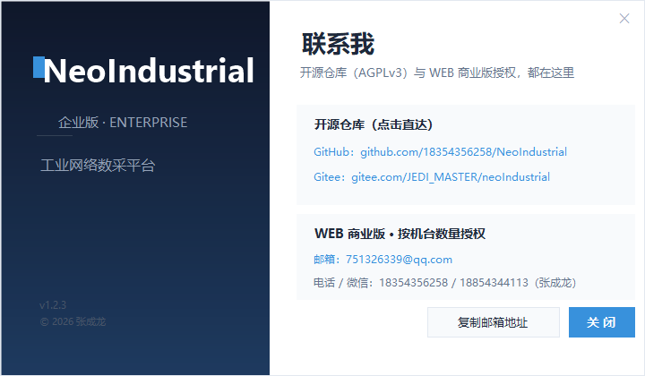

# 工业数采平台企业版 · IndustrialDataCollector

<div align="center">

[中文](README.md) | [English](README.en.md)

**新工业 AI 数据基座 · 已开源的工业数据采集桌面客户端**

[](https://dotnet.microsoft.com/)
[](LICENSE)
[]()
[](https://github.com/18354356258/NeoIndustrial)
[](https://gitee.com/JEDI_MASTER/neoIndustrial)


**39 种工业协议驱动 · 五类数据库并行落库 · MQTT 毫秒级上云 · 44 个 MCP AI 工具 · 语义层数字孪生**

GitHub：<https://github.com/18354356258/NeoIndustrial> ｜ Gitee：<https://gitee.com/JEDI_MASTER/neoIndustrial>

</div>

> **一句话定位**：这是一套完整开源（AGPLv3）的工业数据采集与语义建模工作站——向下用 39 种协议驱动连接 PLC、CNC、电力仪表、楼宇设备，向上把数据写入五类数据库、发布到 MQTT，中间提供边缘计算清洗、事件报警、看板监控、REST API、MCP AI 助手与语义层数字孪生建模。源码全部开放，可自行下载、编译、部署与二次开发。

---

## 🧭 这是什么

**IndustrialDataCollector（工业数采平台企业版）** 是一个 Windows 桌面单机程序（WinForms / C# / .NET Framework 4.8），为工厂现场而生：

- **连得上**：39 种生产就绪协议驱动，覆盖 PLC / 控制器、CNC 数控、工业以太网、现场总线、电力能源、楼宇自动化、物联网与半导体设备；
- **采得下**：设备四级树管理、变量点级配置（清洗 / 计算 / 边缘计算 / 自定义脚本 / 报警 / 语义标签）、毫秒级采集周期、断网离线缓存与恢复补发；
- **存得住**：SQLite / MySQL / SQL Server / PostgreSQL / TDengine 五类数据库并行写入，每库独立启停；
- **用得活**：MQTT 双层话题上云、REST API 对接第三方、44 个 MCP 工具让 AI 用自然语言管理设备与变量、语义层数字孪生建模、Fabric 时序分析、Dashboard 看板、配置模板与设备克隆批量部署。

配套中文文档齐全：使用说明书、使用手册、版本记录都在 [`docs/`](docs/) 目录。

---

## 📸 界面速览

<div align="center">

&nbsp;&nbsp;

**▲ 登录页 · 设备树管理 · Dashboard 监控看板**

</div>

更多界面截图见下文各功能章节：变量配置、数据库写入、AI 对话、API 服务、设备模板等。

---

## ✨ 核心能力

| 模块 | 能力说明 |
|------|----------|
| 🔌 **39 种协议驱动** | 按 7 大类组织：PLC/控制器、CNC 数控、工业以太网、现场总线、电力能源、楼宇自动化、物联网/半导体/其他，详见下方驱动清单 |
| 🌳 **设备四级组织** | 公司 → 车间 → 工序 → 设备树形管理，嵌套子分组、拖拽迁移、搜索过滤、状态灯（🟢 采集中 / 🔴 停止 / 🟡 故障） |
| 🎛️ **变量点精细配置** | 每个变量可单独配置：地址 / 数据类型 / 字节序 / 采集周期 / 线性缩放 / 修约 / 9 种边缘清洗策略 / 滤波 / 计算公式 / 自定义脚本 / HH·H·L·LL 四级报警 |
| 🗄️ **五类数据库并行写入** | SQLite / MySQL / SQL Server / PostgreSQL / TDengine，每库独立启停开关，自动建表；另可接入 Oracle / ODBC 数据源供 AI 查询分析 |
| 📡 **MQTT 毫秒级上云** | 双层话题（批量 JSON 包 + 逐变量子话题），断线双路独立离线缓存、恢复自动补发，断网多久都不丢数 |
| 🧠 **语义层数字孪生建模** | 14 种节点类型的语义树、17 种变量关系类型、19 种事件类型，设备树自动同步，把「40001 = 245.6」变成有业务含义的工厂数字孪生 |
| ⚡ **Fabric 时序分析** | 8 种算子热插拔：窗口聚合 / 趋势检测 / 阈值报警 / 异常检测 / 相关性矩阵 / 根因定位 / 趋势预测 / 生产日报 |
| 🤖 **MCP AI 集成** | 内置 MCP Server（44 个工具），Claude Desktop 等 AI 客户端连接后可用自然语言添加设备、配置变量、启停采集、查数据、生成日报 |
| 🌐 **REST API** | 独立 HTTP 服务（默认端口 5000）+ Swagger 在线文档，Bearer Token 认证，供 MES / ERP 等第三方系统取数 |
| 🧩 **事件规则引擎** | 12 种事件处理方式：报警 / 消息 / 邮件 / 短信 / Webhook / 调用 API / 工作流 / 工单 / 触发 MCP 任务 / 触发 AI 分析等 |
| 📦 **模板 · 克隆 · 批量部署** | 设备模板生成 / 套用 / 覆盖，同型号设备一键克隆，百台规模部署从 2 小时变 2 分钟 |
| 🛡️ **配置安全网** | 配置多代滚动备份 + 损坏自动恢复 + Ctrl+Z 一键回退 + 防双开互斥锁 |
| 🔐 **认证与激活** | 用户登录（SHA256 + 盐）、软件激活（机器码硬件绑定，支持在线 / 离线激活）、REST / MCP 双 Token 认证 |
| 🕳️ **网络隧道** | VPN / NAT 通道管理与 IP 映射表，跨网段接入现场设备无需改设备真实 IP |
| 🏷️ **语义标签体系** | 2600+ 词条工业中英词汇表自动翻译，变量保存即生成中文标签路径（如 `一车间/挤压机/28号挤压机/料筒温度`） |
| 🌍 **中英双语** | 约 650 个翻译项运行时即时切换，无需重启 |

---

## 🔌 内置驱动：7 大类 · 39 种

全部驱动为真实协议实现（非模拟桩），由 `DriverManager` 统一注册调度，添加设备时先选大类再选驱动。

### ⚙️ PLC / 控制器（12 种）

| 驱动 | 支持的品牌 / 协议 |
|------|------------------|
| **Modbus TCP** | 施耐德、西门子、三菱、台达、汇川、信捷等所有支持 Modbus TCP 的设备（支持 0/1/3/4xxxx 四区地址） |
| **Modbus RTU** | 串口 RS-232/485，同上 |
| **Siemens S7** | S7-200/300/400/1200/1500，支持 DB / Input / Output / Merker |
| **Siemens 840D** 🔑 | Sinumerik 840D/840Di 数控系统直连（读 NCK 变量） |
| **Beckhoff ADS** | TwinCAT 2/3 全系列（ADS/TCP 帧） |
| **CODESYS** | CODESYS V3+ 兼容控制器（倍福、和利时、汇川等，Modbus TCP 标准） |
| **Mitsubishi FX** | FX1S/1N/2N/3U/5U 系列（编程口完整 FX 帧 + 校验和） |
| **Mitsubishi MELSEC** | iQ-R/iQ-F/Q/L 系列（MC 协议） |
| **Keyence KV** | KV-5000/7000/8000 系列 |
| **Panasonic Mewtocol** | FP 全系列（Mewtocol + BCC） |
| **Omron FINS** | 欧姆龙 CJ/CS/CP 全系列 |
| **Omron HostLink** | 欧姆龙 HostLink 协议设备 |

### 🔧 CNC 数控机床（4 种）

| 驱动 | 说明 |
|------|------|
| **Fanuc FOCAS** 🔑 | 0i/16i/18i/21i/30i/31i/32i，读写宏变量 + 主轴负载 + 报警号 |
| **Haas CNC** | NGC 控制器全系列（RS232 Q 命令协议） |
| **Mazak** | Mazatrol 控制器（Smooth 系列，RS232/ASCII） |
| **Heidenhain** 🔑 | TNC 系列（HEIDENHAIN Remo Tools / DNC） |

### 🌐 工业以太网（5 种）

| 驱动 | 说明 |
|------|------|
| **EtherNet/IP** 🔑 | Rockwell AB ControlLogix / CompactLogix |
| **PROFINET** | 西门子 PROFINET IO |
| **OPC UA** | 跨平台数据建模（OPC 基金会官方栈） |
| **OPC DA** 🔑 | 经典 OPC Data Access（COM Interop） |
| **OPC UA PubSub** | OPC UA 发布/订阅模式 |

### 🔗 现场总线（3 种）

| 驱动 | 说明 |
|------|------|
| **PROFIBUS** | 西门子 PROFIBUS DP（TCP 网关） |
| **DeviceNet** 🔑 | Allen-Bradley（CIP Explicit） |
| **CC-Link** 🔑 | 三菱 CC-Link（远程设备站） |

### ⚡ 电力 / 能源（2 种）

| 驱动 | 说明 |
|------|------|
| **IEC 104** | 电力远动规约（变电站自动化） |
| **DNP3** | 北美电力 / 水务 SCADA（IEEE 1815） |

### 🏢 楼宇自动化（5 种）

| 驱动 | 说明 |
|------|------|
| **BACnet** | 霍尼韦尔 / 江森 / 西门子楼控（HVAC / 照明 / 安防） |
| **KNX** 🔑 | 智能建筑总线（照明 / 窗帘 / 温控） |
| **DALI** | 数字可寻址照明（IEC 62386） |
| **LonWorks** 🔑 | 楼宇控制网络 |
| **M-Bus** | 热表 / 水表 / 气表 / 电表（EN 13757） |

### ☁️ 物联网 / 半导体 / 其他（8 种）

| 驱动 | 说明 |
|------|------|
| **MQTT Subscribe** | 订阅第三方 MQTT Broker 数据（反向采集，自动识别批量 / 单变量格式） |
| **Sparkplug B** | 工业 IoT 的 MQTT 子协议 |
| **HTTP REST** | RESTful JSON API 轮询采集 |
| **DLMS/COSEM** 🔑 | 智能电表国际标准（HDLC + CRC16） |
| **HART IP** 🔑 | HART 仪表 IP 版（标准 HART-IP Command 3/9） |
| **MTConnect** | 数控机床互联标准（开放免版税） |
| **SECS/GEM** 🔑 | 半导体设备通信标准 |
| **Simulator** | 内置 20+ 模拟变量（正弦波 / 方波 / 随机 / 递增），零硬件走通全流程 |

> ⚠️ **关于需要授权的驱动（请务必先读）**
>
> **本仓库内置的 39 种驱动全部为开源实现**，随包分发的运行库同样采用开源许可，**不预置、不附带任何需要向原厂购买的商业授权驱动**。
>
> 如果现场设备用到的协议需要商业授权驱动，有两条路：**① 自行接入** —— 你已购买并取得授权的驱动（`.dll` / `.zip`）可自行部署接入；**② 让 AI 添加** —— WEB 商业版内置「采集驱动管理」，可上传驱动，也可让平台 AI 联网检索候选驱动，AI 会先说明来源与授权、经你同意后再安装。**授权仍由使用者自行取得，平台只负责装载，不代购、不破解。**
>
> 下面带 🔑 标记的驱动，其规范、SDK 或运行库受**原厂或标准组织的商业授权 / 会员资格**约束。**用于生产、商用或对外交付前，请先联系对应厂家或授权机构，购买正版授权、取得正式许可后再使用**；未取得授权时，请仅用于学习、研究与测试评估。
>
> 本软件只实现协议对接，**不附带、不代购、不破解、不分发任何厂商 SDK、授权文件、授权码或功能选件**，也不代理任何厂商授权。
>
> | 🔑 需授权驱动 | 该联系谁 | 授权形态（示例） |
> |---|---|---|
> | Fanuc FOCAS | 发那科 FANUC 原厂 / 授权代理 | FOCAS 库授权（需签授权协议） |
> | Heidenhain（Remo Tools / DNC） | 海德汉 HEIDENHAIN | 机床 DNC / Remo 付费选件 |
> | Siemens 840D（OPC UA / Access MyMachine） | 西门子 SIEMENS | 数控系统付费运行时选件 |
> | SECS/GEM | SEMI（标准文件需购买）+ 所用设备厂商 SDK 授权方 | 标准文件 + 厂商 SDK |
> | OPC DA | 所对接的第三方 OPC Server 厂商 | OPC Server 商业授权 |
> | HART IP | FieldComm Group | 会员资格 / 规范授权 |
> | EtherNet/IP / DeviceNet | ODVA | 会员资格 + 规范订阅 |
> | CC-Link | CC-Link 协会（CLPA） | 会员资格 / 规范授权 |
> | KNX | KNX 协会 | 会员资格（规范仅对会员开放） |
> | DLMS/COSEM | DLMS User Association | 会员资格（规范仅对会员开放） |
> | LonWorks | LonMark International / 授权方 | 会员资格 / 规范授权 |
>
> **未标记的驱动**（Modbus、Siemens S7、三菱 MC/FX、基恩士 KV、松下 Mewtocol、欧姆龙 FINS/HostLink、倍福 ADS、CODESYS、Haas、Mazak、MTConnect、PROFIBUS、PROFINET、BACnet、OPC UA、IEC 104、DNP3、DALI、M-Bus、MQTT、Sparkplug B、HTTP REST 等）为公开协议实现，通常无需向厂商购买授权即可实现：其中 **MTConnect 官方明确为开放免版税标准**、**PI 官方明确实现 PROFINET/PROFIBUS 不需要会员**、**Beckhoff 允许免版税再分发未修改的 ADS DLL**；另有部分协议的**规范文档本身需付费购买或仅对会员开放**（如 ASHRAE 135 / BACnet、IEC 62386 / DALI、EN 13757 / M-Bus、IEC 60870-5-104、IEEE 1815 / DNP3），但**仅需购买规范文档即可自行实现**，不涉及向厂商付费授权。**是否需授权最终以原厂与标准组织现行条款为准，本表只作提示。**
>
> **合规与责任**：使用者须自行确认并取得所用设备与协议所需的全部授权和许可；本软件按「现状」提供，不对第三方协议授权情况作担保，因未取得授权而使用相关协议所产生的责任与纠纷由使用者自行承担。

---

## 🚀 快速开始

### 环境要求

| 项目 | 最低要求 | 推荐配置 |
|------|----------|----------|
| 操作系统 | Windows 7 SP1 / Windows Server 2008 R2 | Windows 10 / Windows Server 2019+ |
| 运行时 | .NET Framework 4.8（[官方下载](https://dotnet.microsoft.com/download/dotnet-framework/net48)） | 同左 |
| 内存 | 4 GB | 8 GB+ |
| 硬盘 | 500 MB（不含数据存储） | SSD 1 GB+ |

### 从源码编译

**方式一：命令行（推荐）**

```bash
git clone https://github.com/18354356258/NeoIndustrial.git
cd NeoIndustrial
setup.bat
msbuild IndustrialDataCollector.sln /p:Configuration=Release
```

`setup.bat` 一键准备环境，依次做三件事：

1. **清理编译缓存**——删除旧的 `bin/`、`obj/`，防止 CS0579 重复特性等报错；
2. **解除文件安全标记**——对下载的 zip，Windows 会打上 Mark of the Web 标记导致编译报错，脚本自动 `Unblock-File`；
3. **还原 NuGet 包**——本机没有 `nuget.exe` 会自动下载并执行 `nuget restore IndustrialDataCollector.sln`。

**方式二：Visual Studio**

用 **VS 2019 或更高版本**（需勾选 .NET Framework 4.8 开发包）打开仓库根目录的 `IndustrialDataCollector.sln` → 右键解决方案「还原 NuGet 包」→ 直接「生成」。

**编译产物**

```
IndustrialDataCollector/bin/Release/IndustrialDataCollection.exe
```

> 说明：`packages/`、`bin/`、`obj/` 均不入库（见 `.gitignore`），克隆后由 NuGet 还原生成；目标框架 .NET Framework 4.8，平台 AnyCPU。

**不想自己编译？** 可在 [GitHub Releases](https://github.com/18354356258/NeoIndustrial/releases) 或 [Gitee Releases](https://gitee.com/JEDI_MASTER/neoIndustrial/releases) 获取已编译的客户端压缩包，解压即用；正式使用需按提示完成软件激活。

### 首次启动

1. 双击 `IndustrialDataCollection.exe`（免安装；程序带全局单实例锁，重复启动会提示「已在运行中」）；
2. 首次启动自动创建本地数据库、认证库、语义库和配置目录，无需预配置；
3. 使用默认账号 **admin / admin** 登录（密码 SHA256 + 盐加密存储）——**正式环境请第一时间修改默认密码**；
4. 完成软件激活：输入许可证密钥，系统自动读取本机 CPU ID + 硬盘序列号 + MAC 生成机器码（SHA256，自动过滤虚拟网卡），支持**在线激活**或**离线激活**（导出申请文件 → 获取授权文件 → 导入）；激活信息保存在配置目录 `license.dat`，每次启动自动校验。授权获取方式见文末「许可证」；
5. 启动后先进入**看板**主窗体，点击「采集管理」进入数采主界面，两边可共存。

### 第一个采集任务（模拟器模式，无需硬件）

1. 打开 **数据源管理** → 右键设备树 → **添加分组**（如 `测试车间`）→ **新增设备**；
2. 驱动选 **Simulator**，保存；
3. 双击设备进入配置页 → **添加变量**（或点「导出模板」编辑 CSV 后「导入 CSV」批量创建）；
4. 右键设备 → **启动采集**，状态灯变绿；
5. 回到**看板**：实时数据、报警面板、数据流速率已经滚动起来；
6. 再按需配置：**数据库配置**（落库）→ **MQTT 配置**（上云）→ **语义管理**（建模）。

---

## 📖 使用手册要点

> 完整文档见 [`docs/工业数采平台企业版使用说明书_20260911.md`](docs/工业数采平台企业版使用说明书_20260911.md) 与 [`docs/工业数采平台_使用手册.md`](docs/工业数采平台_使用手册.md)。推荐配置主线：**先配数据库 → 再配 MQTT → 建分组加设备 → 配变量 → 启动采集验证 → 最后建语义树和事件规则**。

### 设备管理（四级组织架构）

- 公司 → 车间 → 工序 → 设备树形组织，支持嵌套子分组、拖拽迁移、右键「移动到…」精准迁移；
- 搜索框按设备名 / IP 实时过滤；分组路径决定设备的中文标签路径；
- 每台设备独立采集线程，参数变更点「应用」即时热生效，无需停止采集；
- 跨网段设备在「网络通道」里新建 VPN / NAT 隧道并维护 IP 映射表（如 `192.168.1.50:502 → 10.8.0.5:1502`）。

### 变量点配置

每个设备下挂载变量点（Data Points），定义采集什么、怎么处理：

| 字段 | 说明 |
|------|------|
| 变量名 | 中文标识（如 `料筒温度`），保存后自动生成中英文标签路径 |
| 地址 | 协议地址（Modbus `40001`、S7 `DB1.DBD0`…；Modbus 支持 0/1/3/4xxxx 四区前缀） |
| 数据类型 | Int16 / Int32 / Float / Double / Bool / String 等 |
| 字节序 | ABCD（大端）/ DCBA（小端）/ BADC / CDAB |
| 采集周期 | 毫秒级，按需设置 |
| 线性缩放 | `y = kx + b`，原始值 × k + b = 工程值 |
| 修约 / 滤波 | 保留 N 位小数；一阶 / 二阶滤波 |
| 报警阈值 | HH / H / L / LL 四级设定 |

**边缘计算（9 种清洗策略）**，按管线顺序在数据源头完成质量控制：

| 类别 | 策略 |
|------|------|
| 值修正（自动改值） | 空值过滤（NaN/Inf/负数）、死区抑制、尖峰抑制（MAD 法）、变化率限制、限幅、异常值剔除（3σ） |
| 质量检测（只记日志） | 冻结检测、IQR 四分位距、量程合理性 |

另支持**计算公式**（如 `{Temp} * 1.8 + 32`）与**自定义脚本**处理。

<div align="center">

&nbsp;&nbsp;

&nbsp;

**▲ 变量点配置：基本信息 / 报警 / 边缘计算 / 自定义脚本 / 高级计算**

</div>

### MQTT 数据格式

全局配置一个 Broker（地址、端口、话题前缀、QoS、自动重连），每台设备可选发布模式：

- **Original（仅批量）**：每个采集周期发布一条完整设备数据包到 `{前缀}/{设备名}`；
- **Resolved（批量 + 子话题）**：同时发布逐变量子话题 `{前缀}/{设备名}/{变量名}`。

批量消息示例：

```json
{
  "timestamp": 1783176200000,
  "driver": "SiemensS7",
  "device": "28号挤压机",
  "values": [
    {
      "id": "28号挤压机|料筒温度",
      "dt": "float",
      "v": "72.3",
      "u": "℃",
      "variable_id": "a1b2c3d4-...",
      "tag_cn": "一车间/挤压机/28号挤压机/料筒温度"
    }
  ]
}
```

子话题载荷：`{"timestamp":...,"variable":"料筒温度","value":72.3,"unit":"℃"}`。

如果设备 / 网关自己往 MQTT 发数据，用 **MQTT Subscribe** 驱动建设备：`TopicFilter` 填 `#` 收全部，填 `/变量名` 精确订阅单变量，系统自动识别批量 / 单变量两种 JSON 格式。

### 数据库写入配置

| 数据库 | 默认端口 | 特点 |
|--------|----------|------|
| SQLite | —（文件型） | 零配置，开箱即用 |
| MySQL | 3306 | 中小规模 |
| SQL Server | 1433 | Windows 企业生态 |
| PostgreSQL | 5432 | 高并发场景 |
| TDengine | 6041（REST） | 高频时序数据（按设备自动建超级表） |

- **五类库各自独立启停**，可只开一个，也可全部并行写入；每库可勾选写入的设备（留空 = 全部）；
- 测试连接（5 秒超时）通过后自动创建 `industrial_data` 表；
- **数据保留天数**默认 7 天，每 6 小时分批清理；**设为 0 = 永久保留**（TDengine 的保留期建议直接用库侧 `KEEP` 参数管理）；
- 统一表结构：`industrial_data(db_type, device, variable, data_type, value, unit, tag, tag_zh, timestamp)`——人查数据看 `tag_zh` 中文标签路径；TDengine 里保留字自动映射为 `tag_id / val / ts`；
- **双路独立离线缓存**：MQTT 与数据库各自维护缓存表（`Data/offline_cache.db`），后台每 10 秒检查补发，单路故障不影响另一路，断网多久都不丢数。

<div align="center">

&nbsp;

**▲ 数据库写入配置 · TDengine 落库数据**

</div>

### MCP AI 集成

平台内置 MCP Server（默认端口 **5101**，被占用自动递增；Streamable HTTP 传输；支持 Token 认证）。任何支持 MCP 的 AI 客户端（Claude Desktop 等）连接 `http://[本机IP]:[端口]/mcp?token=***` 后，即可用自然语言操控平台：

```text
用户：帮我加一台西门子 S7-1200 PLC，IP 192.168.1.100
AI  ：已创建设备（协议 S7），接下来配置变量，请提供寄存器地址。

用户：温度 DB1.DBD0（浮点），压力 DB1.DBD4（浮点），状态 M0.0（布尔）
AI  ：已添加 3 个变量（℃ / MPa / 布尔），需要设置报警吗？

用户：温度超 85 报警，压力低于 0.3 也报警，然后开始采集
AI  ：已配置报警规则，采集已启动。
```

工具覆盖（共 44 个，另按已配置数据源自动注册直查工具）：

| 类别 | 代表工具 |
|------|----------|
| 设备与采集控制 | `add_device` `update_device` `start_device` `stop_device` `reload_config` |
| 变量管理 | `add_variables` `update_variables` |
| 数据查询 | `query_realtime_data` `query_history_data` `get_database_status` |
| 数据源分析 | `datasource_list_all` `datasource_table_info` `datasource_query_timerange`（AI 自动完成「发现数据源 → 看表结构 → 取样 → 按时间段查询」，全程无需手写 SQL） |
| 语义层查询 | `semantic_get_full_tree` `semantic_get_alarm_summary` `semantic_get_upstream` |
| 语义层写入 | `semantic_create_variable_relation` `semantic_batch_update_nodes` |
| Fabric 分析 | `fabric_list_operators` `fabric_execute` |
| 数据库直查 | 按已配置数据源自动注册 |
| 平台自描述 | `introduce_platform`（overview / drivers / tools / semantic / fabric / tdengine / best_practices） |

> **安全设计**：删除设备、删除变量关系等高危操作已从 MCP 移除，请在 UI 中操作并经过二次确认闸门。

<div align="center">

&nbsp;

**▲ MCP 服务配置 · AI 对话式管理设备与变量**

</div>

### REST API

菜单进入 **API 服务配置**（默认端口 **5000**，可启用 Swagger 文档，Token 认证）：

```text
Authorization: Bearer <your-token>

GET /api/devices                              # 设备列表
GET /api/devices/{id}/realtime                # 实时数据
GET /api/variables/{id}/history?from=&to=     # 历史数据
GET /api/status                               # 系统状态
```

<div align="center">


**▲ REST API 服务配置**

</div>

### CSV 批量导入 / 导出

变量多时：设备配置页点「**导出模板**」→ 在 CSV（UTF-8，Excel 可直接编辑）中填变量 →「**导入 CSV**」批量创建：

```csv
变量名,地址,数据类型,单位,修约,缩放K,缩放B,HH,H,L,LL
主机电流,40001,float32,A,2,0.1,0,500,450,50,10
温度传感器,40003,int16,℃,1,1,0,300,250,-10,-20
```

### 日志与排错

- 程序目录 `Logs/log_YYYYMMDD.txt` + 配置目录 `log_YYYYMMDD.txt`，**30 天前日志自动清理**；
- 崩溃记录在配置目录 `crash.log`——排查崩溃先看这里；
- 配置文件在 `%LOCALAPPDATA%\IndustrialDataCollection\`（`devices.json` 设备配置、`groups.json` 分组、`mqtt.json`、`dbConfig.json`、`semantic_v2.db` 语义库、`auth.db` 账号库、`license.dat` 激活文件）。

---

## 🏭 企业级能力

### 🧬 语义层 · 数字孪生建模

把「40001 = 245.6」变成「3 号挤压车间 ▶ 1 号线 ▶ 主机 ▶ 缸体温度」：

- **自动建模**——设备树 + 数据源树自动同步成语义树（14 种节点类型：公司 / 事业部 / 工厂 / 车间 / 区域 / 产线 / 工位 / 设备 / 变量 / 数据源 / 数据库 / 表 / 字段 / 自定义），手动调整过的层级记录 `parent_override` 不会被覆盖；
- **17 种变量关系类型**——上限 / 下限 / 目标值 / 标准值 / SOP 步骤 / 质量判定 / 报警阈值 / 补偿系数 / 计算公式 / 业务关联 / 影响等，支持单向 / 双向引用；
- **19 种事件类型**——通用事件、变量运行事件、系统诊断事件，挂在语义树节点上；
- **影响图谱**——一键展示节点上下游影响链，AI 可追溯任意数据的「来源设备 → 采集驱动 → 数据库表 → MQTT 话题」；
- **大树不卡**——节点超过 200 自动启用懒加载，搜索走内存缓存。

### ⚡ Fabric 时序分析引擎

8 种算子热插拔，用 JSON 声明分析意图（算子 + 参数 + 时间范围 + 输出），分析结果随原始数据一起落库、可被 MCP AI 工具实时查询：

| 算子 | 功能 | 工业场景 |
|------|------|---------|
| **窗口聚合** | avg / max / min / sum / count / stddev | 小时均温、日峰值功率 |
| **趋势检测** | 时序走势判定 | 温度缓升、效率衰减 |
| **阈值报警** | 动态上下限判定 | 自适应工艺窗口报警 |
| **异常检测** | 离群点识别 | 突跳报警、传感器漂移 |
| **相关性矩阵** | 多变量相关分析 | 振动与温度的关联诊断 |
| **根因定位** | 上下游影响链追溯 | 波动源头的快速定位 |
| **趋势预测** | 线性回归趋势外推 | 预测性维护、备件预警 |
| **生产日报** | 自动汇总生成 | 班组日报、运行报告 |

### 📊 Dashboard 监控看板

启动即进入的默认主窗体，2 秒自动刷新，8 大面板：设备总览（在线率）、数据吞吐量（最近 120 秒采集 / 发布趋势）、服务状态（采集 / MQTT / REST / MCP / 连续运行时长）、驱动分布环形图、最近告警、数据库连接状态、系统日志实时滚动、设备采集状态矩阵。看板与数采页**共存模式**，一边监控一边改配置；报警面板 20 分钟窗口自动清除、同类报警合并计数、四色分级。

<div align="center">


</div>

### 📦 模板 · 克隆 · 批量部署

- **生成模板**——把一台设备的完整配置（驱动 + 变量 + 语义关系 + Fabric 算子 + 事件规则 + 清洗策略）沉淀为模板；
- **套用 / 覆盖**——模板按变量名匹配套用到新设备，批量应用后每台可单独调整、互不干扰；
- **一键克隆**——同型号设备右键克隆，改 IP 和寄存器地址即可上线，5 分钟继承全部配置。

<div align="center">

&nbsp;

**▲ 设备模板生成 / 配置管理 · 套用覆盖快速复制配置**

</div>

### 🛡️ 工业级可靠性

| 能力 | 说明 |
|------|------|
| **双路独立离线缓存** | MQTT 与数据库各自独立缓存（`Data/offline_cache.db`），每 10 秒检查补发，单路故障不影响另一路，断网多久都不丢数 |
| **指数退避重连** | 数据库连续失败按 2ⁿ 秒退避（上限 60 秒），退避期内由离线缓存接管，成功自清零 |
| **心跳监测** | 设备心跳表记录在线状态，状态转换才写入（节流，不刷盘） |
| **配置多代备份** | `devices.json` 每次保存自动轮转备份（`.bak.1 ~ .bak.10`），支持「配置历史版本」一键回退与 **Ctrl+Z** 快速回退 |
| **损坏自动恢复** | 配置解析失败自动从备份恢复，损坏文件存档为 `.corrupted` 供排查，日志标记 `[CRITICAL]` / `[RECOVERY]` |
| **事件规则引擎** | 12 种处理方式完整管线：仅记录 / 报警 / 消息通知 / 站内消息 / 邮件 / 短信 / Webhook / 调用 API / 触发工作流 / 生成工单 / 触发 MCP 任务 / 触发 AI 分析，支持 `{设备}` `{级别}` 等模板变量 |
| **有序退出** | 托盘退出按 5 步逆序关闭（后启动的先关），每步 5 秒超时保护，保证 MQTT / 数据库 / 采集线程有序释放 |

---

## 🆚 企业版 vs WEB 商业版

同一套工业协议驱动内核，两种交付形态：**企业版**是装在工控机上的桌面客户端（本仓库开源），**WEB 商业版**是长在服务器上的浏览器平台（闭源商业授权）。

| 能力维度 | 企业版（本仓库） | WEB 商业版 |
|----------|:---:|:---:|
| 工业协议驱动（PLC / CNC / 电力 / 楼宇 / 半导体） | 39 种 | 39 种（同源内核，**全部为开源实现**） |
| MQTT 毫秒级推送 | ✅ | ✅ |
| SQLite / MySQL / SQL Server / PostgreSQL | ✅ | ✅ |
| TDengine 时序数据库 | ✅ | ✅ |
| 达梦 DM8 国产数据库 | ❌ | ✅ |
| MCP AI 工具 | 44 | **150** |
| **采集驱动管理（驱动大类 / 上传 / AI 添加）** | ❌ | ✅ |
| REST API | ✅ | ✅ |
| CSV 批量导入导出 | ✅ | ✅ |
| 界面语言 | 中 / 英 | 中 / 英 / 越（含内置手册） |
| **语义层数字孪生建模** | ✅ | ✅ |
| **知识图谱 2D / 3D 可视化** | ❌ | ✅ |
| **Fabric 时序分析引擎** | ✅（8 算子） | ✅（27 算子） |
| **Dashboard 监控大屏** | ✅ | ✅ |
| **配置模板 · 设备克隆** | ✅ | ✅ |
| **离线缓存 · 补发** | ✅ | ✅ |
| **事件规则引擎** | ✅ | ✅ |
| **认证 · 硬件绑定 · Token** | ✅ | ✅ |
| **多人多角色在线协作 · 操作审计** | ❌ | ✅ |
| **AI 多智能体协同 · 记忆与技能进化** | ❌ | ✅ |
| **浏览器 B/S 访问（无需逐机安装）** | ❌ | ✅ |
| **信创 Linux 适配（自包含运行包）** | ❌ | ✅ |
| **配置文件多代滚动备份** | ✅ | ✅ |
| **商用授权 · 技术支持** | ✅ | ✅ |

> 🖥️ **企业版**：单机桌面、离线可用、39 种驱动开箱即用，适合单厂单机的深度采集与边缘侧部署。
> 🌐 **WEB 商业版**：把整座工厂装进浏览器——多人协作、AI 多智能体、2D / 3D 知识图谱与信创适配，详见下一节。

---

## 🌐 WEB 商业版：把整座工厂装进浏览器

> 企业版是"装在工控机上的软件"；WEB 商业版是"长在服务器上的工业数据操作系统"。
>
> 同一套工业协议驱动内核，加上 B/S 架构的多人协作、AI 多智能体与 2D / 3D 工业语义——它不是桌面版的移植，而是按 Web 原生重新设计的一代平台。

它解决的正是桌面版解决不了的事：

- **一台工控机 → 一张网**：浏览器打开就用，不再一台机器装一套；升级一次，全厂生效。
- **一个人操作 → 一群人在线**：组织 / 角色 / 用户三级权限，多人同时在线；谁改了配置、谁导出了数据，全部留痕可审计。
- **外挂 AI → AI 原生**：平台内建 AI 对话页与多智能体体系，AI 可以直接操作平台——增删设备、配置变量、查历史数据、生成看板；智能体之间还能互相派单协作。
- **用完就忘 → 越用越懂你**：AI 记忆、团队知识蒸馏、技能自动沉淀与自我进化——用得越久，它越懂你的产线和工艺。
- **二维表格 → 2D / 3D 知识图谱**：工业语义树 + 关系图谱可视化，把"40001 = 245.6"变成看得见、点得开、能追溯的工厂数字孪生。

### 📸 语义知识图谱 2D / 3D 动图

<div align="center">

&nbsp;

&nbsp;

&nbsp;


**▲ 语义知识图谱精选动态 —— 布局切换 · 2D / 3D 演示**（动图循环播放）

</div>

### 🎬 WEB 商业版功能演示（视频）

<div align="center">

<a href="https://github.com/18354356258/NeoIndustrial/raw/main/picture/web-demo.mp4"></a>

**▶ 点击封面即可观看完整演示视频**（约 1 分 53 秒 · 1080p）

</div>

这段视频是 **WEB 商业版** 的完整功能演示——从**数据采集**出发，经过**语义图谱（2D / 3D）**，直到 **Hermes Evolution Agent**：

- **① 数据采集**：设备树管理（车间 → 工序 → 设备）+ 变量级精细配置；支持**自定义 Python 后处理脚本**（如滑动窗口滤波），原始信号直接加工成业务可用的干净数据；
- **② 语义图谱 2D / 3D**：力导 / 聚类 / 树形 / 星形 / 星轨 / 流程 / 芯片 / 环等多布局一键切换；3D 球面模式可旋转、缩放，全局关系网络一眼看清；
- **③ Hermes Evolution Agent**：**自主进化**（技能自动沉淀、进化提案审批、使用反馈驱动的技能自我修正）· **定时任务**（报表 / 查询汇总 / 预警 / 简报四类任务，cron 自由定义，AI 指令自动生成日报与 HTML 看板）· **推送设置**（站内消息 + 邮件 + 企业微信 / 钉钉 / 飞书机器人，多渠道推送统一配置）。

> 📺 视频基于 WEB 商业版录制；按 1080p 观看效果最佳。

### 核心能力

| 能力 | 说明 |
|------|------|
| 🔌 工业协议驱动 | 内置 **39 种**生产就绪驱动，**全部为开源实现**（PLC / CNC / 电力 / 楼宇 / 半导体 / 仪表），与企业版同源内核；按 7 个驱动大类组织，连设备时先选大类再选驱动 |
| 🧩 采集驱动管理 | 驱动清单可视化：驱动名 / 大类 / 来源 / 提供者 / 大小 / 安装时间 / 状态，支持按关键字、来源、大类筛选；**已购买的商业授权驱动或开源驱动，可由用户自行上传**；内置驱动可禁用·恢复，插件驱动可删除 |
| 🤖 AI 添加驱动 | 平台里没有的协议，直接让 AI 联网检索候选 → 说明来源与授权 → 经你同意后安装到指定大类；来源地址与时间由服务端登记，清单标「AI 添加」 |
| 🗄️ 数据库并行写入 | 6 类：SQLite / MySQL / SQL Server / PostgreSQL / TDengine / 达梦 DM8（国产信创） |
| 🤖 MCP 原子工具 | **150 个** AI 可调用工具，覆盖设备采控、采集驱动、数据源、离线缓存、Fabric 时序分析与工业语义 |
| 🧠 AI 多智能体 | 内置对话页；可自建智能体、按能力边界授权、智能体之间协同派单完成任务 |
| 🔬 Fabric 时序分析引擎 | 27 个算子热插拔：聚合 / 相关 / 异常 / 数字孪生对标 / 变化率 / 累积 / 阈值 / 预测…… |
| 🕸️ 工业语义与知识图谱 | 语义树 + 变量关系类型 + 事件类型目录，2D / 3D 图谱可视化 |
| 📊 看板 · 告警 · 定时任务 | 实时监控大屏、四级报警、定时报表、站内消息与文档工作区 |
| 👥 权限与审计 | 组织 / 角色 / 用户三级权限，用户活动追溯、系统日志、硬件管理 |
| 🌍 三语 | 中文 / English / Tiếng Việt 运行时切换，内置产品手册同三语 |
| 🧩 信创适配 | 提供 Linux x64 自包含运行包（免装 .NET），国产数据库达梦 DM8 开箱可用 |
| 🚀 部署 | 单机即可跑；.NET 8 + Blazor，浏览器访问，无需在每台机器上安装客户端 |

### 🔌 驱动大类与驱动管理

连设备是「先选大类、再选驱动」的两级结构，采集配置页与驱动管理页共用同一份大类定义：

| 大类 | 覆盖 | 内置驱动 |
|------|------|:---:|
| 工业常用 | 通用工业协议、仿真 | 8 |
| PLC / 工控 | 主流 PLC 与控制器 | 8 |
| 数控系统 | CNC / 机床 | 6 |
| 楼宇自动化 | 暖通、照明、仪表 | 4 |
| 电力 / 能源 | 电力规约与电能 | 5 |
| 半导体 | 半导体与总线 | 3 |
| 通用 / 其他 | HTTP、OPC 等 | 5 |

驱动管理页能做的事：

- **统一清单**：驱动名 / 大类 / 来源 / 提供者 / 大小 / 安装时间 / 状态 / 操作，可按关键字、来源、大类筛选；
- **上传即归类**：上传 `.dll` 或 `.zip`（≤100 MB）时必须先选大类，装完直接落在对应大类下；
- **就地改类**：插件驱动可在列表里直接切换大类；
- **内置可禁用·恢复，插件可删除**：内置驱动随程序发布（代码不可删），可禁用可恢复；上传的插件驱动可整包删除；
- **AI 添加**：平台里没有的协议，直接让 AI 联网检索候选 → 说明来源与授权 → 你同意后安装到指定大类（清单标「AI 添加」，来源地址与时间由服务端登记，不采信 AI 自称）。

### 企业版 / WEB 商业版 怎么选

| 你的场景 | 推荐版本 |
|----------|----------|
| 单厂单机深度使用、桌面部署，需要语义层与看板 | **企业版**——本仓库开源，客户端可在 Releases 直接下载，正式授权按机器码申请 |
| 多人在线协作、全厂级治理、AI 多智能体、信创环境 | **WEB 商业版**——联系作者申请授权（按机台数量授权） |

### 获取方式（重要）

- **企业版（本仓库）**：客户端可直接从本仓库 Releases 页面下载试用；源码 AGPLv3，可克隆自行编译。正式授权请发送机器码至邮箱。
- **WEB 商业版**：**不提供公开下载**，需联系作者申请授权，按机台数量计费。
- **客户端内入口**：企业版客户端「帮助 → 联系我」可一键打开两个开源仓库、复制授权邮箱；登录页也有「联系我 · 获取商业版 / 查看开源仓库」链接。



**申请 WEB 商业版授权时，请在邮件 / 来电中写清楚以下五项：**

1. **使用场景**——用在什么行业、哪条产线、解决什么问题；
2. **申请主体**——公司 or 个人；
3. **申请用途**——内部生产 / 项目交付 / 教学研究 / 二次开发……；
4. **授权时间**——期望的授权周期与上线时间；
5. **设备数量**——需要纳管的设备 / 机台数量。

📮 邮箱：`751326339@qq.com`　📞 电话：`18354356258` / `18854344113`（张成龙，微信同号）

---

## 📁 目录结构

```text
NeoIndustrial/
├─ IndustrialDataCollector/            # 客户端源码（WinForms / C# / .NET Framework 4.8）
│  ├─ Drivers/                         # 39 种协议驱动实现（DriverManager 统一注册调度）
│  ├─ Forms/                           # 窗体：看板、设备配置、语义管理、模板、激活、MCP/REST 配置等
│  ├─ Services/                        # 采集、数据库写入、MQTT 发布、离线缓存、MCP、语义、模板、隧道等服务
│  │  ├─ DbAdapters/                   # MySQL / SQL Server / PostgreSQL / Oracle / SQLite 查询适配器
│  │  └─ Sinks/                        # 数据输出端
│  ├─ Models/                          # 设备、变量、语义节点、事件等数据模型
│  ├─ Utils/                           # 工业词汇表（2600+ 词条中英映射）等工具
│  ├─ Controls/                        # 自定义控件
│  ├─ Properties/                      # 程序集信息
│  ├─ Resources/                       # Lang_zh.json / Lang_en.json 中英语言包
│  └─ IndustrialDataCollection.csproj  # 工程文件
├─ docs/                               # 使用说明书 / 使用手册 / 版本记录（中文）
├─ picture/                            # README 截图
├─ IndustrialDataCollector.sln         # 解决方案
├─ setup.bat                           # 一键环境准备（清缓存 → 解除文件安全标记 → NuGet 还原）
└─ LICENSE                             # GNU AGPLv3
```

---

## 📋 版本记录

**当前开源客户端版本：v1.2.3**（`IndustrialDataCollector/Properties/AssemblyInfo.cs`）

### v1.2.3 — 当前开源版本

- 39 种协议驱动、五类数据库并行写入、MQTT 双层话题、44 个 MCP 工具、REST API、语义层建模、Fabric 分析、看板、模板与克隆、软件激活模块；
- 包含 **Modbus 四区地址解析修复**（2026-09-21）：变量地址支持 `0xxxx`（线圈）/ `1xxxx`（离散输入）/ `3xxxx`（输入寄存器）/ `4xxxx`（保持寄存器）四区前缀，1 基减 1；纯数字按保持寄存器 0 基协议地址直读（兼容旧点表）；读失败实时值显示 `ERR` 并写入日志（不再静默归 0），TCP / RTU 双驱动同步。

### 平台版本线（v1.2.0 → v2.6.1）

| 版本 | 日期 | 里程碑 |
|------|------|--------|
| v1.2.0 | 2026-06-04 | 登录认证系统、数据库写入系统（统一 `industrial_data` 表）、Git 仓库初始化 |
| v1.3.0 | 2026-06-10 | REST API 服务（HttpListener + Swagger + Token 认证） |
| v1.3.1 | 2026-06-14 | 离线缓存与断点续传（OfflineCacheService）、数据库重连机制重构 |
| v1.3.3 ~ v1.3.11 | 2026-06-15~16 | 设备树重构（ListView → TreeView）、拖拽分组、嵌套子分组、分组持久化 |
| v1.6.0 | 2026-06-19 | 9 种数据清洗策略、「应用」按钮即时热生效 |
| v1.7.0 | 2026-06-21 | 语义标签体系（中英文标签路径 + 工业词汇自动翻译 + MQTT 标签输出） |
| v1.8.0 | 2026-06-21 | 数据源标签系统（表级 / 列级语义标签 + 智能表分类） |
| v1.9.0 | 2026-06-21 | 数据看板首页（8 大面板、暗色主题、自动恢复运行状态） |
| v1.10.0 | 2026-06-22 | 语义管理系统 v2（14 种节点类型、25 个语义 MCP 工具、自动同步） |
| v1.11.0 | 2026-06-27 | 事件处理引擎（12 条处理管线 + 模板变量 + 自动触发） |
| v1.12.0 | 2026-06-30 | MCP 设备 CRUD 与采集控制、声明式 Fabric 分析模型 |
| v2.1 | 2026-07-05 | 双路独立离线缓存加固（MQTT / DB 各自独立补发） |
| v2.5.0 | 2026-07-08~10 | 15 个驱动真协议化改造（串口 / TCP / OPC / 总线组）、MCP 数据源分析工具组、配置多代备份 |
| v2.5.1 | 2026-07-11 | TDengine 自动建表修复、驱动 7 大类重新分配、MCP 平台自描述工具、防双开 |
| v2.6.0 | 2026-07-14 | IDbAdapter 通用数据库查询架构（6 适配器 + 数据源路由）、MCP 语义同步修复 |
| v2.6.1 | 2026-07-15 | TDengine 多变量落盘根因修复（时间戳碰撞）、跨页树联动、分组 GUID 体系 |

> 完整版本历史（含每次变更的文件级明细）见 [`docs/工业数采平台_版本记录.md`](docs/工业数采平台_版本记录.md)。

---

## ❓ 常见问题

**Q1：设备显示离线但实际在线？**
① `ping` / `telnet` 测网络连通性；② 防火墙放行对应端口（Modbus 502、S7 102 等）；③ 核对站号 / 波特率与设备一致；④ 跨网段设备确认已选择网络通道；⑤ 查 `Logs/` 日志具体报错。

**Q2：数据写不进数据库？**
① 数据库配置里点「测试连接」；② 确认该库的「启用写入数据库」开关已勾选；③ 确认账号有 CREATE TABLE / INSERT 权限；④ 检查设备是否勾选进该库的写入设备列表（留空 = 全部）；⑤ 断连期间数据在离线缓存里，恢复后自动补发。

**Q3：7 天前的数据没了 / 想永久保留？**
数据库配置里「数据保留天数」默认 7 天，**设为 0 即永久保留**。注意：TDengine 目标的数据保留请直接用库侧 `KEEP` 参数管理（如 `ALTER DATABASE mytsdb KEEP 3650d`）。

**Q4：MQTT 断连会丢数据吗？**
不会。MQTT 与数据库双路独立缓存，每 10 秒检查补发，恢复后自动续传，断多久都不丢。

**Q5：MCP / AI 助手连接不上？**
① 确认 MCP 服务已启用；② 以日志里的「实际生效端口」为准（默认 5101，被占用自动 +1，最多尝试 10 次）；③ 权限不足时以管理员运行，或执行 `netsh http add urlacl url=http://+:5101/ user=Everyone`；④ Token 要与配置一致；⑤ 传输方式选 Streamable HTTP。

**Q6：REST API 端口提示权限不足？**
服务默认监听全网卡（`http://+:5000/`），以管理员身份运行程序，或执行 `netsh http add urlacl url=http://+:5000/ user=Everyone`。

**Q7：忘记 admin 密码？**
账号库在配置目录 `auth.db`，请联系技术支持（`751326339@qq.com`）协助重置，勿直接删除 `auth.db` 以免丢失其他配置关联。

**Q8：配置改坏了怎么回退？**
工具 → 配置历史版本 → 选中版本 →「回退到此版本」；或非编辑状态按 **Ctrl+Z** 快速回退上一版。损坏自动恢复机制也会兜底。

**Q9：批量上 10 台同型号设备，逐台配太慢？**
配好 1 台 → 右键**克隆设备**（勾选全部内容）→ 改新设备 IP 和寄存器地址 → 应用 → 启动采集。不同型号用**配置模板**按变量名匹配套用。

**Q10：Modbus 采集值全 0？**
检查变量地址写法：`40001` 表示保持寄存器 1 号（1 基减 1）、`30001` 表示输入寄存器；纯数字按保持寄存器 0 基协议地址直读。读失败时实时值会显示 `ERR` 并写日志，不再静默归 0。

**Q11：提示「工业数采平台已在运行中」？**
程序防双开（全局互斥锁）。先关闭当前实例（托盘右键退出）；若上次异常退出残留锁，等几秒重试。

**Q12：换机 / 重装系统要注意什么？**
备份整个配置目录（重点是 `devices.json`、`groups.json`、`mqtt.json`、`dbConfig.json`、`semantic_v2.db`、`license.dat`）；`license.dat` 与机器码绑定，换机前先联系技术支持重新激活。

---

## 🤝 贡献

一个人可以走得很快，但一群人才能走得很远。

这个项目是一位美术生用业余时间从零写出来的——它一定不完美，一定有 Bug，一定有你连上了但我没见过的工业设备。**这没关系。** 开源的意义不在于「交出一个完美的成品」，而在于「把一个有用的东西放在这里，让需要它的人能用它、改进它、一起把它变得更好」。

- 🐛 **提交 Bug** → [GitHub Issues](https://github.com/18354356258/NeoIndustrial/issues) 或 [Gitee Issues](https://gitee.com/JEDI_MASTER/neoIndustrial/issues)，请附上当日日志与驱动类型（脱敏后）；
- 💻 **贡献代码** → Fork → 分支改动 → PR（确保编译通过）；
- 🔌 **需求新驱动** → Issue 标签 `driver-request`，写清设备品牌、型号与协议；
- 💬 **就是想聊聊** → Issues 随便开，不一定要有 Bug 才来。

如果你在厂里用它连上了 PLC 解决了实际问题——**来留个言告诉我**，那比一万个 Star 都让我开心。如果你觉得这个项目帮到了你，**点个 Star ⭐**，那是对独立开发者最大的鼓励。

---

## 📄 许可证

**源码**以 [GNU Affero 通用公共许可证 v3.0（AGPLv3）](LICENSE) 开源（Copyright 2026 张成龙）。你可以自由使用、修改与分发，但**衍生作品必须同样以 AGPLv3 开源**；若把修改后的版本作为网络服务提供给他人使用，也必须向使用者提供完整的对应源码。保留版权与许可声明。

**第三方依赖**：各 NuGet 包遵循其自身开源许可（如 MySqlConnector (MIT)、OPC UA 官方栈（OPC Foundation, RCL）、S7netplus、NModbus、Npgsql、System.Data.SQLite、MQTTnet、log4net 等），清单见 `IndustrialDataCollector/packages.config`（31 个包）。

**软件激活**：客户端内置激活模块（`LicenseService` / `ActivationForm`），首次启动需输入许可证密钥完成机器码绑定激活，支持在线 / 离线两种方式。获取正式授权请发送机器码至 `751326339@qq.com`，或致电 `18354356258` / `18854344113`（张成龙，微信同号）。

**驱动授权与合规**：见「内置驱动」章节的 🔑 说明——本软件只实现协议对接，不附带、不代购、不破解、不分发任何厂商 SDK、授权文件或功能选件；带 🔑 驱动用于生产与商用前，请自行向原厂或标准组织取得正式授权。

---

## 👤 关于作者

**张成龙** — 美术生出身，全栈开发者，数字孪生系统架构师。

我不是计算机科班出身。色彩、光影、构图才是我的语言。但数字孪生的世界里，光画得好看没用——没有真实数据灌进去，再华丽的 3D 模型也只是个精致的空壳。开发数字孪生系统时，我需要能连上工厂里每一台设备的东西。PLC、CNC、传感器、仪表、电力柜、楼宇控制器……它们说着完全不同的语言：Modbus、S7、FOCAS、BACnet……市面上的方案要么贵到离谱，要么重到工控机根本跑不动，要么老旧到连 AI 的影子都看不见。

**没找到能用的。于是我放下了画笔，打开了 Visual Studio。**

从 UI 原型到低层协议栈，从 Dashboard 到时序引擎，从数据库 schema 到 39 种工业协议驱动——全部一个人写完。不是为了证明什么，只是真的需要一副能连接一切工业设备的神经末梢，让数字孪生活起来。

现在，我把这套企业版桌面客户端完整开源——AGPLv3。因为我知道：一个工程师想在自己的工控机上装一套能用的、干净的、不设防的数据采集软件有多难。工业数据采集是数字孪生和智能制造最基础的地基——地基应该干干净净地开放。你下载、编译、连接你的设备，就这么简单。

我的铝挤压数字孪生项目已经落地，正在疯狂迭代中（三语界面、AI 分析、温度趋势看板、秒级数据同步、毫米级模型位移、实时对应生产现场设备运转），未来有可能也会开源，敬请期待。

希望你喜欢，希望它有用。

---

<div align="center">

**IndustrialDataCollector — 数字孪生的数据基座**

© 2026 张成龙 · GNU AGPLv3

📮 `751326339@qq.com` ｜ 📞 `18354356258` / `18854344113`（微信同号）

</div>
